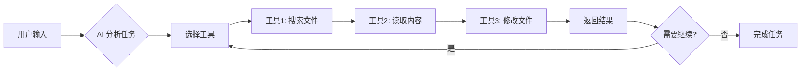
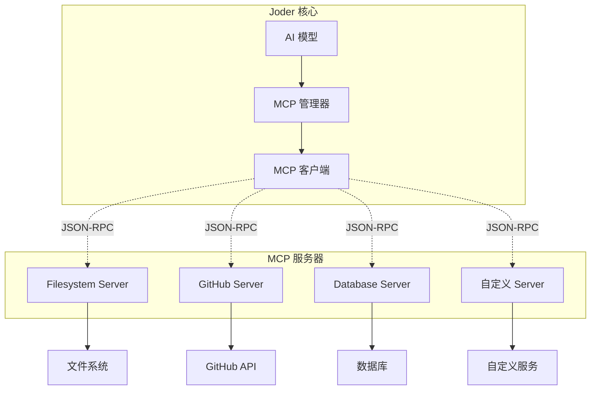
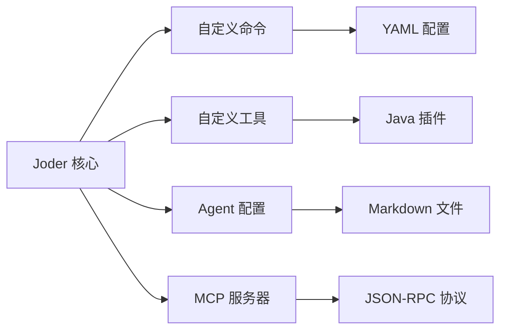
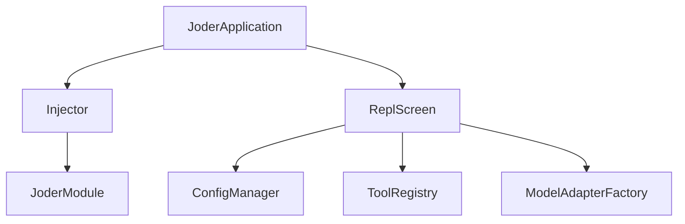

# Joder: 一个优雅的 AI 终端构建者

<div align="center">

> 🚀 AI 驱动的智能终端助手 - Java 实现

**通过自然语言与 AI 对话，让终端操作变得更加智能和高效**

[](https://www.oracle.com/java/)
[](https://maven.apache.org/)
[](LICENSE)
[](CONTRIBUTING.md)

[English](README_EN.md) | 简体中文

[快速开始](#-快速开始) • [特性介绍](#-核心特性) • [使用文档](doc/QUICK_START.md) • [架构设计](#-项目架构) • [贡献指南](#-贡献指南)

</div>

---

## 📚 目录

- [项目简介](#-项目简介)
- [核心特性](#-核心特性)
- [快速开始](#-快速开始)
- [使用示例](#-使用示例)
- [内置命令](#-内置命令)
- [配置详解](#-配置详解)
- [高级功能](#-高级功能)
- [项目架构](#-项目架构)
- [开发指南](#-开发指南)
- [常见问题](#-常见问题)
- [技术栈](#-技术栈)
- [贡献指南](#-贡献指南)
- [许可证](#-许可证)

## 🎯 项目简介

Joder 是一个功能强大的 AI 驱动终端助手工具，旨在通过 AI 技术提升终端操作效率。它支持**多模型协作**、**智能工具链**、**MCP 协议集成**和**终端原生交互**，让开发者能够通过自然语言完成复杂的终端任务。

### 💡 为什么选择 Joder？

- **🤖 多模型支持** - 集成 Claude、GPT、Qwen、DeepSeek 等主流 AI 模型，随时切换
- **🔧 强大工具链** - 内置 17+ 个专业工具，覆盖文件操作、代码搜索、命令执行等场景
- **🔌 可扩展性** - 支持 MCP 协议，轻松集成第三方工具和服务
- **🎨 终端原生** - 基于 Lanterna 的美观交互界面，支持语法高亮和 Markdown 渲染
- **🔒 安全可控** - 多级权限管理，所有危险操作均需确认
- **📦 开箱即用** - 简单配置即可启动，无需复杂依赖

### 🎬 快速演示

```bash
# 启动 Joder
$ java -jar target/joder-1.0.0.jar

# 与 AI 对话
> 帮我创建一个 Spring Boot 项目的 README 文件

[AI 自动分析项目结构并生成 README]
✅ 已创建文件: README.md

# 代码搜索
> 在项目中搜索所有 TODO 注释

[AI 调用 grep 工具]
📄 找到 12 个 TODO:
  - src/main/java/Service.java:45
  - src/main/java/Controller.java:23
  ...

# 执行命令
> 帮我查看最近的 5 个 git 提交

[AI 执行 git log 命令]
commit a1b2c3d...
Author: John Doe
Date: 2024-01-15
...
```

## ✨ 核心特性

### 🤖 多模型 AI 协作

Joder 支持多个主流 AI 模型提供商，可根据任务需求灵活切换：

| 提供商 | 支持的模型 | 特点 | 适用场景 |
|--------|-----------|------|----------|
| **Anthropic Claude** | Claude 3.5 Sonnet<br/>Claude 3 Opus<br/>Claude 3 Haiku | 强大的推理能力<br/>支持长上下文 | 复杂代码分析<br/>架构设计 |
| **OpenAI GPT** | GPT-4o<br/>GPT-4 Turbo<br/>GPT-3.5 Turbo | 广泛的知识库<br/>快速响应 | 通用问答<br/>代码生成 |
| **阿里云通义千问** | Qwen Max<br/>Qwen Plus<br/>Qwen Turbo | 中文优化<br/>性价比高 | 中文项目<br/>大规模调用 |
| **DeepSeek** | DeepSeek Chat<br/>DeepSeek Coder | 代码优化<br/>低成本 | 代码重构<br/>批量处理 |

**模型切换**：在运行时可随时切换模型，无需重启

```bash
> /model                    # 查看当前模型
当前模型: claude-3-sonnet-20240229

> /model gpt-4o             # 切换到 GPT-4
✅ 已切换到模型: gpt-4o

> /model list               # 列出所有可用模型
📋 可用模型:
  - claude-3-sonnet-20240229 ⭐
  - claude-3-opus-20240229
  - gpt-4o
  - qwen-max
  - deepseek-chat
```

### 🛠️ 智能工具链

Joder 内置 **17+ 个**专业工具，AI 可根据任务自动选择和组合调用：

#### 📁 文件操作工具

| 工具名称 | 功能描述 | 使用示例 |
|---------|---------|----------|
| `file_edit` | 智能文件编辑<br/>支持创建、修改、替换 | 创建配置文件<br/>批量重构代码 |
| `read_file` | 读取文件内容<br/>支持大文件分段读取 | 分析日志文件<br/>查看配置 |
| `list_dir` | 列出目录内容<br/>支持过滤和排序 | 浏览项目结构<br/>查找文件 |
| `file_tree` | 展示文件树<br/>可视化目录结构 | 项目概览<br/>文档生成 |
| `glob` | 文件模式匹配<br/>支持通配符 | 批量查找文件<br/>模式搜索 |

#### ⚙️ 执行类工具

| 工具名称 | 功能描述 | 使用示例 |
|---------|---------|----------|
| `bash` | Bash 命令执行<br/>支持命令链和管道 | 运行测试<br/>部署应用 |
| `grep` | 代码内容搜索<br/>支持正则表达式 | 查找 TODO<br/>定位函数 |

#### 🌐 网络工具

| 工具名称 | 功能描述 | 使用示例 |
|---------|---------|----------|
| `web_search` | 互联网搜索<br/>实时信息检索 | 查找文档<br/>技术调研 |
| `url_fetch` | 获取 URL 内容<br/>支持 HTML 解析 | 读取API文档<br/>网页分析 |

#### 🧠 记忆与任务管理

| 工具名称 | 功能描述 | 使用示例 |
|---------|---------|----------|
| `memory_save` | 保存知识记忆<br/>持久化上下文 | 记录项目规范<br/>保存配置 |
| `memory_load` | 加载知识记忆<br/>恢复上下文 | 读取项目信息<br/>继续任务 |
| `task_add` | 添加待办任务<br/>任务跟踪 | 创建开发计划<br/>Bug追踪 |
| `task_list` | 列出任务列表<br/>查看进度 | 查看待办事项<br/>进度汇报 |
| `task_update` | 更新任务状态<br/>进度管理 | 标记完成<br/>修改优先级 |

#### 🔧 工具自动编排

AI 会自动分析任务并编排工具调用顺序：



### 🔌 MCP 协议支持

Joder 完整实现 [Model Context Protocol](https://modelcontextprotocol.io/) 规范，支持集成外部工具和服务：

#### 🏛️ MCP 架构设计



#### 🛠️ MCP 服务器管理

- **动态管理** - 运行时启动、停止、重载服务器
- **自动发现** - 自动注册服务器提供的工具
- **灵活配置** - 支持命令、参数、环境变量配置
- **错误处理** - 完善的错误检测和恢复机制

#### 📚 支持的 MCP 服务器

| 服务器 | 功能 | 安装命令 |
|--------|------|----------|
| **Filesystem** | 文件系统操作 | `npm install -g @modelcontextprotocol/server-filesystem` |
| **GitHub** | GitHub 集成 | `npm install -g @modelcontextprotocol/server-github` |
| **Slack** | Slack 集成 | `npm install -g @modelcontextprotocol/server-slack` |
| **PostgreSQL** | 数据库访问 | `npm install -g @modelcontextprotocol/server-postgres` |
| **Custom** | 自定义服务 | 自定义开发 |

详细使用方法请参考 [快速开始指南](doc/QUICK_START.md#mcp-服务器集成)

### 🎨 终端原生交互

Joder 基于 **Lanterna** 框架构建，提供丰富的终端交互体验：

#### ✨ 界面特性

- **📝 Markdown 渲染** - 支持代码块、表格、列表等
- **🎨 语法高亮** - 支持 Java、Python、JavaScript 等语言
- **🔄 差异对比** - 直观展示代码修改
- **🌊 流式响应** - 实时显示 AI 生成过程
- **🌈 主题定制** - 支持 Dark、Light、Nord 等多种主题

#### 🎬 界面演示

```
┌──────────────── Joder v1.0.0 ────────────────┐
│ 🤖 模型: claude-3-sonnet     🔒 模式: strict     │
├────────────────────────────────────────────┤
│                                            │
│ > 帮我创建一个 Python 快速排序算法        │
│                                            │
│ 🔧 [file_edit] 创建文件: quicksort.py      │
│                                            │
│ ✅ 我已经为你创建了快速排序算法实现:       │
│                                            │
│ ```python                                  │
│ def quicksort(arr):                       │
│     if len(arr) <= 1:                     │
│         return arr                        │
│     ...                                   │
│ ```                                        │
│                                            │
│ > _                                        │
└────────────────────────────────────────────┘
```

### 🔒 安全权限控制

Joder 提供四种权限模式，平衡安全性与便利性：

| 模式 | 说明 | 只读操作 | 编辑操作 | 命令执行 | 适用场景 |
|------|------|--------|--------|----------|----------|
| **default** | 默认模式 | ✅ 自动 | ⚠️ 需确认 | ⚠️ 需确认 | 日常使用 |
| **acceptEdits** | 自动编辑 | ✅ 自动 | ✅ 自动 | ⚠️ 需确认 | 可信环境 |
| **plan** | 计划模式 | ✅ 自动 | ❌ 禁止 | ❌ 禁止 | 方案设计 |
| **bypassPermissions** | 完全自动 | ✅ 自动 | ✅ 自动 | ✅ 自动 | 调试演示 |

#### 🛡️ 安全机制

- **白名单机制** - 可配置可信工具列表
- **路径限制** - 限制文件系统访问范围
- **命令黑名单** - 阻止危险命令执行
- **审计日志** - 记录所有操作历史

详细配置请参考 [权限管理详解](doc/QUICK_START.md#权限管理详解)

### 📦 可扩展架构

Joder 采用模块化设计，支持多种扩展方式：

#### 🎯 扩展点



- **📝 自定义命令** - 通过 YAML 文件快速添加命令
- **🔧 工具扩展** - 插件式工具注册机制
- **🤖 Agent 配置** - 创建专属 AI 助手
- **🔌 MCP 集成** - 接入第三方服务
- **⚙️ 依赖注入** - 基于 Guice 的 DI 设计

## 🚀 快速开始

### 📚 环境要求

| 组件 | 要求 | 验证命令 |
|------|------|----------|
| **JDK** | Java 17+ | `java -version` |
| **Maven** | 3.8+ | `mvn -version` |
| **操作系统** | macOS, Linux, Windows | - |
| **终端** | 支持 ANSI 颜色 | 推荐 iTerm2, Windows Terminal |

### 🛠️ 安装步骤

#### 1️⃣ 克隆项目

```bash
# HTTPS 方式
git clone https://github.com/yourusername/joder.git

# SSH 方式
git clone git@github.com:yourusername/joder.git

# 进入项目目录
cd joder
```

#### 2️⃣ 构建项目

```bash
# 完整构建（包含测试）
mvn clean package

# 快速构建（跳过测试）
mvn clean package -DskipTests

# 并行构建（提高速度）
mvn clean package -T 4
```

**预期输出**：
```
[INFO] ------------------------------------------------------------------------
[INFO] BUILD SUCCESS
[INFO] ------------------------------------------------------------------------
[INFO] Total time:  01:23 min
[INFO] Finished at: 2024-01-15T10:30:00+08:00
[INFO] ------------------------------------------------------------------------
```

✅ 构建成功后，`target/` 目录下将生成 `joder-1.0.0.jar`

#### 3️⃣ 配置 API 密钥

**创建配置目录**：

```bash
# macOS/Linux
mkdir -p ~/.config/joder

# Windows PowerShell
New-Item -ItemType Directory -Force -Path "$env:USERPROFILE\.config\joder"
```

**创建配置文件**：`~/.config/joder/config.conf`

```hocon
joder {
  # ========================================
  # AI 模型配置
  # ========================================
  
  models {
    # Anthropic Claude（推荐）
    anthropic {
      api-key = "sk-ant-xxxxxxxxxxxx"  # 替换为你的 API Key
      base-url = "https://api.anthropic.com"
      timeout = 60  # 超时时间（秒）
    }
    
    # OpenAI GPT
    openai {
      api-key = "sk-xxxxxxxxxxxx"  # 替换为你的 API Key
      base-url = "https://api.openai.com"
      timeout = 60
    }
    
    # 阿里云通义千问
    qwen {
      api-key = "sk-xxxxxxxxxxxx"  # 替换为你的 API Key
      base-url = "https://dashscope.aliyuncs.com"
      timeout = 60
    }
    
    # DeepSeek
    deepseek {
      api-key = "sk-xxxxxxxxxxxx"  # 替换为你的 API Key
      base-url = "https://api.deepseek.com"
      timeout = 60
    }
  }
  
  # 默认模型
  default-model = "claude-3-sonnet-20240229"
  
  # 权限模式
  permissions {
    mode = "default"  # default / acceptEdits / plan / bypassPermissions
  }
  
  # UI 配置
  ui {
    theme = "dark"      # dark / light / nord / monokai
    language = "zh_CN"  # zh_CN / en_US
  }
}
```

**🔑 获取 API 密钥**：

- **Anthropic Claude**: [console.anthropic.com](https://console.anthropic.com/)
- **OpenAI GPT**: [platform.openai.com/api-keys](https://platform.openai.com/api-keys)
- **阿里云通义千问**: [dashscope.console.aliyun.com](https://dashscope.console.aliyun.com/)
- **DeepSeek**: [platform.deepseek.com](https://platform.deepseek.com/)

> 💡 **提示**：你只需配置一个 AI 提供商即可开始使用

**使用环境变量（可选）**：

```bash
# 设置环境变量
export ANTHROPIC_API_KEY="sk-ant-xxxxxxxxxxxx"
export OPENAI_API_KEY="sk-xxxxxxxxxxxx"

# 在配置文件中引用
joder.models.anthropic.api-key = "${ANTHROPIC_API_KEY}"
joder.models.openai.api-key = "${OPENAI_API_KEY}"
```

#### 4️⃣ 运行 Joder

**方式 1：使用 JAR 文件（推荐）**

```bash
java -jar target/joder-1.0.0.jar
```

**方式 2：使用 Maven**

```bash
mvn exec:java -Dexec.mainClass="io.leavesfly.joder.JoderApplication"
```

**方式 3：使用启动脚本**

```bash
# macOS/Linux
chmod +x bin/joder.sh
./bin/joder.sh

# Windows
bin\joder.bat
```

**方式 4：自定义 JVM 参数**

```bash
# 增加内存、启用 G1 GC
java -Xmx2g -Xms1g -XX:+UseG1GC -jar target/joder-1.0.0.jar
```

#### 🎉 首次启动

成功启动后，你将看到欢迎界面：

```
     __  ____  ____  __________ 
    / / / __ \/ __ \/ ____/ __ \
 __/ / / / / / / / / __/ / /_/ /
/ __/ / /_/ / /_/ / /___/ _, _/ 
\___/_\____/_____/_____/_/ |_|  
                                
🚀 AI-Powered Terminal Assistant
Version: 1.0.0 | Java 17

📋 快速帮助:
  输入消息开始对话
  使用 /help 查看命令列表
  使用 /model 切换 AI 模型
  按 Ctrl+C 退出

>
```

#### ✅ 验证安装

运行系统诊断命令：

```bash
> /doctor

🏥 系统诊断报告:

✅ Java 版本: 17.0.5
✅ 配置文件: ~/.config/joder/config.conf
✅ Anthropic API: 正常
✅ OpenAI API: 正常
⚠️  Qwen API: 未配置
⚠️  DeepSeek API: 未配置

🛠️  已注册工具: 17
🔌 MCP 服务器: 0 个运行中
```

## 🎯 使用示例

### 💬 基础对话

启动 Joder 后，直接输入问题即可与 AI 对话：

```bash
> 你好，请介绍一下自己

[🤖 Claude 3 Sonnet]
你好！我是 Joder，一个 AI 驱动的终端助手。我可以帮助你完成各种任务：

🔧 **我能做什么**：
- 文件操作：创建、编辑、搜索文件
- 代码编写：生成代码、代码审查、重构
- 命令执行：运行 Bash 命令、系统管理
- 信息检索：网络搜索、文档查找
- 任务管理：创建待办、跟踪进度

💡 **使用技巧**：
- 使用 @ 符号引用文件：@README.md
- 使用 /命令 执行内置命令
- 我会自动调用工具完成任务

有什么我可以帮你的吗？
```

### 📝 文件操作

#### 创建文件

```bash
> 帮我创建一个 Python 脚本，实现二分查找算法

[🔧 AI 自动调用 file_edit 工具]
✅ 已创建文件：/path/to/binary_search.py

已为你创建 Python 脚本 `binary_search.py`，实现了二分查找算法：

```python
def binary_search(arr, target):
    """
    二分查找算法
    时间复杂度: O(log n)
    """
    left, right = 0, len(arr) - 1
    
    while left <= right:
        mid = (left + right) // 2
        
        if arr[mid] == target:
            return mid
        elif arr[mid] < target:
            left = mid + 1
        else:
            right = mid - 1
    
    return -1

# 测试代码
if __name__ == "__main__":
    test_arr = [1, 3, 5, 7, 9, 11, 13, 15]
    result = binary_search(test_arr, 7)
    print(f"查找结果: {result}")
```
```

#### 读取和分析文件

```bash
> 分析一下 @src/main/java/io/leavesfly/joder/JoderApplication.java 的代码结构

[🔧 AI 读取文件并分析]

📊 **代码结构分析**

**主要功能：**
1. **应用启动** - `main()` 方法作为程序入口
2. **依赖注入** - 使用 Guice 初始化组件
3. **REPL 启动** - 初始化并运行交互界面

**类依赖关系：**


**代码质量评估：**
- ✅ 清晰的职责分离
- ✅ 良好的错误处理
- ✅ 使用依赖注入模式
```

### 🔍 代码搜索

```bash
> 在当前项目中搜索所有包含 "TODO" 的 Java 文件

[🔧 AI 调用 grep 工具]

📄 **找到 12 个 TODO 标注：**

1. 📍 **src/main/java/io/leavesfly/joder/tools/ToolRegistry.java:42**
   ```java
   // TODO: 实现工具热重载功能
   ```

2. 📍 **src/main/java/io/leavesfly/joder/services/model/ModelAdapter.java:87**
   ```java
   // TODO: 添加流式响应支持
   ```

3. 📍 **src/main/java/io/leavesfly/joder/cli/CommandParser.java:156**
   ```java
   // TODO: 支持命令自动补全
   ```

[还有 9 个...]

建议优先处理高优先级的 TODO 项。
```

### ⚡ 命令执行

```bash
> 帮我查看最近 5 条 Git 提交记录

[🔧 AI 调用 bash 工具]
$ git log -5 --oneline --decorate

a1b2c3d (HEAD -> main) feat: 添加 MCP 协议支持
e4f5g6h feat: 实现流式响应
i7j8k9l fix: 修复文件编辑工具 Bug
m0n1o2p docs: 更新 README 文档
q3r4s5t refactor: 重构权限管理模块

📊 **提交分析：**
- 功能开发: 2 次
- Bug 修复: 1 次
- 文档更新: 1 次
- 代码重构: 1 次
```

### 🌐 网络搜索

```bash
> 搜索一下 Java 17 的新特性

[🔧 AI 调用 web_search 工具]

🌐 **Java 17 新特性总结：**

1. **Sealed Classes（密封类）**
   - 限制哪些类可以继承或实现
   - 提供更好的封装性
   
2. **Pattern Matching for switch**
   - switch 表达式模式匹配
   - 简化代码逻辑
   
3. **Records**
   - 简化数据载体类的创建
   - 自动生成构造函数、getter 等
   
4. **Text Blocks**
   - 多行字符串支持
   - 更便于处理 JSON、SQL 等

更多详情请参考 Oracle 官方文档。
```

### 📚 上下文引用

使用 `@` 符号引用文件或目录：

```bash
# 引用单个文件
> 请分析 @pom.xml 的依赖配置

# 引用多个文件
> 对比 @src/main/java/Main.java 和 @src/test/java/MainTest.java 的区别

# 引用整个目录
> 总结一下 @doc/ 目录下所有文档的主要内容

# 使用通配符
> 分析 @src/**/*.java 中的所有公共类
```

### 📦 批量操作

```bash
> 将所有 Java 文件中的 "log.info" 替换为 "logger.info"

[🔧 AI 批量处理文件]

正在处理 23 个 Java 文件...

✅ **已完成**：
- 处理文件: 23
- 修改次数: 67
- 耗时: 2.3 秒

文件列表：
  1. src/main/java/Service.java (修改 3 处)
  2. src/main/java/Controller.java (修改 5 处)
  ...
```

## 📖 内置命令

Joder 提供了 **24+ 个**内置命令，用于管理模型、配置、MCP 服务器等：

| 命令 | 描述 | 用法示例 |
|------|------|----------|
| `/help` | 显示帮助信息 | `/help` |
| `/model` | 查看或切换 AI 模型 | `/model gpt-4o` |
| `/config` | 查看和修改配置 | `/config set joder.theme light` |
| `/mcp` | 管理 MCP 服务器 | `/mcp list` |
| `/agents` | 管理 AI 代理 | `/agents list` |
| `/clear` | 清空屏幕 | `/clear` |
| `/history` | 显示消息历史 | `/history` |
| `/cost` | 显示成本统计 | `/cost` |
| `/debug` | 调试工具和日志控制 | `/debug on` |
| `/doctor` | 诊断系统健康状况 | `/doctor` |
| `/login` | 管理 API 密钥配置 | `/login anthropic` |
| `/logout` | 注销当前会话 | `/logout` |
| `/export` | 导出数据 | `/export messages` |
| `/exit` | 退出程序 | `/exit` |

更多命令详见 [使用指南](doc/USAGE.md)。

## 🔧 配置详解

### 配置文件位置

Joder 支持三级配置优先级（从高到低）：

1. **项目配置**: `{project}/.joder/config.conf`
2. **全局配置**: `~/.config/joder/config.conf`
3. **默认配置**: `src/main/resources/application.conf`

### 主要配置项

#### 模型配置

```hocon
joder.models {
  anthropic {
    api-key = "${ANTHROPIC_API_KEY}"  # 支持环境变量
    base-url = "https://api.anthropic.com"
    timeout = 60
  }
  
  openai {
    api-key = "${OPENAI_API_KEY}"
    base-url = "https://api.openai.com"
    timeout = 60
  }
}

# 默认使用的模型
joder.default-model = "claude-3-sonnet"
```

#### 权限配置

```hocon
joder {
  # 权限模式
  permission-mode = "strict"  # strict / relaxed / auto
  
  # 白名单配置
  permission-whitelist = [
    "read_file",
    "list_dir",
    "grep"
  ]
}
```

#### MCP 配置

```hocon
joder.mcp {
  servers {
    filesystem {
      command = "npx"
      args = ["-y", "@modelcontextprotocol/server-filesystem"]
      env {
        ALLOWED_DIRECTORIES = "/Users/username/projects"
      }
      enabled = true
    }
    
    github {
      command = "npx"
      args = ["-y", "@modelcontextprotocol/server-github"]
      env {
        GITHUB_TOKEN = "${GITHUB_TOKEN}"
      }
      enabled = false
    }
  }
}
```

#### 主题配置

```hocon
joder {
  theme = "dark"  # dark / light / nord / monokai
  
  # 自定义主题颜色
  theme-colors {
    primary = "#0078D4"
    success = "#10B981"
    error = "#EF4444"
    warning = "#F59E0B"
  }
}
```

## 🚀 高级功能

### Agent 配置

创建专属 AI 助手，例如代码评审专家、文档编写专家等：

在 `~/.config/joder/agents/` 或 `{project}/.joder/agents/` 目录下创建 Markdown 文件：

**code-reviewer.md**:
```markdown
# Code Reviewer Agent

你是一个专业的代码审查专家，擅长发现代码中的问题并提供改进建议。

## 职责
- 检查代码规范
- 发现潜在 Bug
- 优化性能问题
- 提升代码可读性

## 工作流程
1. 仔细阅读代码
2. 识别问题和改进点
3. 提供具体的修改建议
4. 解释建议的原因
```

使用 Agent：
```
> /agents use code-reviewer
> 请审查 @src/main/java/io/leavesfly/joder/tools/ToolRegistry.java
```

### 自定义命令

在 `~/.config/joder/commands/` 目录下创建 YAML 文件：

**deploy.yaml**:
```yaml
name: deploy
description: 部署应用到生产环境
prompt: |
  执行以下步骤部署应用：
  1. 运行测试：mvn test
  2. 构建项目：mvn clean package
  3. 上传到服务器：scp target/*.jar user@server:/opt/app/
  4. 重启服务：ssh user@server 'systemctl restart app'
  
  请确保每一步都成功后再继续下一步。
```

使用：
```
> /deploy
```

### MCP 服务器集成

启动 MCP 服务器以扩展 Joder 的能力：

```
> /mcp start filesystem
✅ MCP 服务器 'filesystem' 已启动

> /mcp tools filesystem
📦 可用工具：
  - read_file: 读取文件内容
  - write_file: 写入文件内容
  - list_directory: 列出目录内容
```

## 🏗️ 项目架构

Joder 采用分层架构设计：

```
┌─────────────────────────────────────┐
│         CLI Layer (命令行层)         │
│  CommandParser, Commands, REPL      │
└─────────────────────────────────────┘
                  ↓
┌─────────────────────────────────────┐
│          UI Layer (界面层)          │
│  MessageRenderer, SyntaxHighlighter │
└─────────────────────────────────────┘
                  ↓
┌─────────────────────────────────────┐
│       Service Layer (服务层)        │
│  ModelAdapters, McpManager, etc.   │
└─────────────────────────────────────┘
                  ↓
┌─────────────────────────────────────┐
│        Tool Layer (工具层)          │
│  ToolRegistry, Built-in Tools       │
└─────────────────────────────────────┘
                  ↓
┌─────────────────────────────────────┐
│        Core Layer (核心层)          │
│  ConfigManager, PermissionManager   │
└─────────────────────────────────────┘
```

### 核心组件

- **JoderApplication**: 应用启动入口
- **ReplScreen**: REPL 交互界面
- **ConfigManager**: 配置管理器
- **ModelAdapterFactory**: 模型适配器工厂
- **ToolRegistry**: 工具注册表
- **McpServerManager**: MCP 服务器管理器
- **PermissionManager**: 权限管理器

## 🧪 开发与测试

### 运行测试

```bash
# 运行所有测试
mvn test

# 运行特定测试
mvn test -Dtest=ToolRegistryTest

# 生成测试覆盖率报告
mvn test jacoco:report
```

### 添加新工具

1. 创建工具类，继承 `AbstractTool`：

```java
package io.leavesfly.joder.tools.mytool;

import tools.io.leavesfly.joder.AbstractTool;
import tools.io.leavesfly.joder.ToolResult;
import com.fasterxml.jackson.databind.JsonNode;

public class MyTool extends AbstractTool {

    @Override
    public String getName() {
        return "my_tool";
    }

    @Override
    public String getDescription() {
        return "My custom tool description";
    }

    @Override
    public JsonNode getParametersSchema() {
        // 返回 JSON Schema
    }

    @Override
    protected ToolResult executeInternal(JsonNode arguments) {
        // 实现工具逻辑
        return ToolResult.success("执行成功");
    }
}
```

2. 在 `JoderModule` 中注册工具：

```java
toolRegistry.registerTool(new MyTool(workingDirectory));
```

### 添加新命令

1. 创建命令类，实现 `Command` 接口：

```java
package io.leavesfly.joder.cli.commands;

public class MyCommand implements Command {
    
    @Override
    public String getName() {
        return "mycommand";
    }
    
    @Override
    public String getDescription() {
        return "My custom command";
    }
    
    @Override
    public CommandResult execute(String[] args) {
        // 实现命令逻辑
        return CommandResult.success("执行成功");
    }
}
```

2. 在 `CommandParser` 中注册命令。

## 📚 技术栈

- **JDK**: Java 17
- **构建工具**: Maven 3.8+
- **终端 UI**: Lanterna 3.1.x
- **JSON 处理**: Jackson 2.16+
- **HTTP 客户端**: OkHttp 4.x
- **依赖注入**: Google Guice 7.x
- **日志框架**: SLF4J + Logback
- **配置管理**: Typesafe Config (HOCON)
- **CLI 解析**: Picocli 4.x
- **HTML 解析**: Jsoup 1.17+
- **差异对比**: java-diff-utils 4.12

## 🤝 贡献指南

欢迎贡献代码、报告问题或提出建议！

### 提交 Issue

遇到问题或有功能建议？请创建 [Issue](https://github.com/yourusername/joder/issues)。

### 提交 Pull Request

1. Fork 本项目
2. 创建特性分支：`git checkout -b feature/my-feature`
3. 提交更改：`git commit -am 'Add some feature'`
4. 推送到分支：`git push origin feature/my-feature`
5. 创建 Pull Request

### 代码规范

- 遵循 Java 代码规范
- 编写单元测试
- 更新相关文档
- 提交信息清晰明确

## 📄 许可证

本项目采用 MIT 许可证 - 详见 [LICENSE](LICENSE) 文件。

## 🙏 致谢

- [Lanterna](https://github.com/mabe02/lanterna) - 优秀的终端 UI 框架
- [Anthropic](https://www.anthropic.com/) - Claude AI 模型
- [OpenAI](https://openai.com/) - GPT 系列模型
- [Model Context Protocol](https://modelcontextprotocol.io/) - MCP 协议规范

## 📞 联系方式

- **作者**: Your Name
- **邮箱**: your.email@example.com
- **GitHub**: [@yourusername](https://github.com/yourusername)

---

⭐ 如果这个项目对你有帮助，欢迎 Star！
