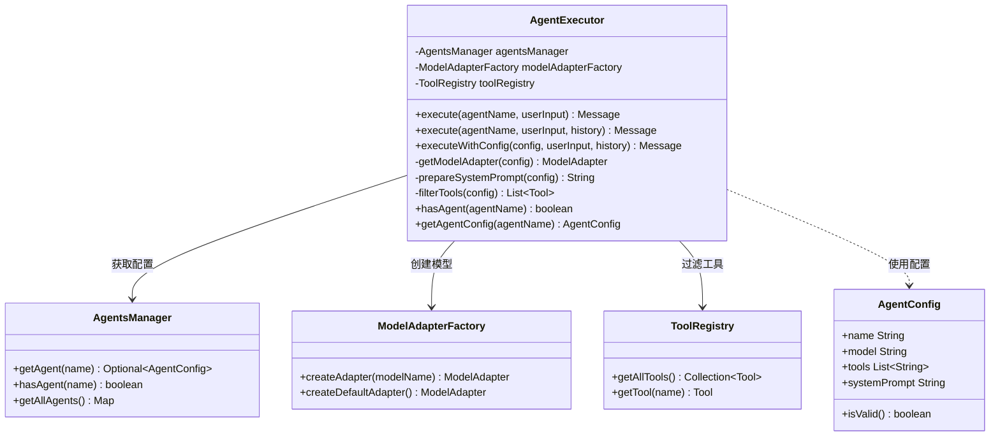
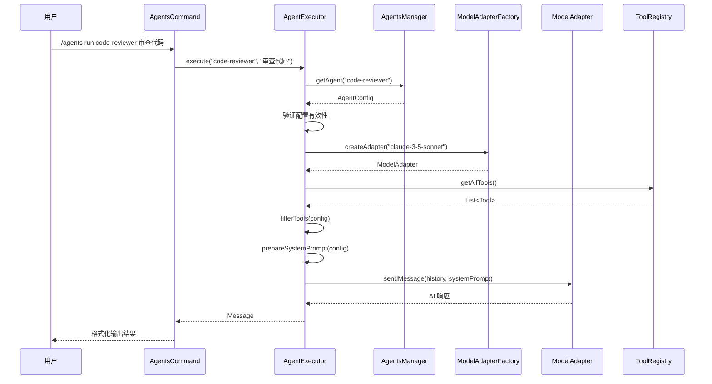

# Agent 执行系统实现报告

## 概述

本文档详细说明了为 Joder 项目实现的 **Agent 执行系统**，该系统使 `AgentsCommand` 能够动态调用工具和模型，实现配置化的 AI 代理执行能力。

## 背景

在实现之前，`AgentsCommand` 仅具备 Agent 配置的管理功能（列表、显示、初始化、重载），但缺少实际执行 Agent 的能力。Agent 虽然可以配置模型和工具列表，但无法真正运行和调用这些资源。

## 实现目标

1. **动态模型调用**：根据 `AgentConfig` 配置的模型名称，动态创建和使用对应的模型适配器
2. **工具过滤机制**：根据 Agent 配置的工具列表，限制可用工具范围
3. **独立执行上下文**：为每个 Agent 创建独立的执行环境和消息历史
4. **系统提示词增强**：自动将工具限制信息添加到系统提示词中
5. **命令行接口**：提供 `/agents run <name> <task>` 命令执行 Agent

## 核心组件

### 1. AgentExecutor（Agent 执行器）

新增核心类 `AgentExecutor`，负责 Agent 的执行逻辑。

#### 架构设计



#### 关键方法说明

##### execute()

```java
public Message execute(String agentName, String userInput, List<Message> messageHistory)
```

执行流程：
1. 从 `AgentsManager` 获取 Agent 配置
2. 验证配置有效性
3. 根据配置创建或获取模型适配器
4. 准备系统提示词（包含工具使用说明）
5. 过滤可用工具
6. 调用模型获取响应
7. 返回 Assistant 消息

##### getModelAdapter()

```java
private ModelAdapter getModelAdapter(AgentConfig agentConfig)
```

模型选择策略：
- 如果 Agent 配置了特定模型（`model` 字段），使用 `ModelAdapterFactory.createAdapter(modelName)`
- 否则使用默认模型 `ModelAdapterFactory.createDefaultAdapter()`

##### prepareSystemPrompt()

```java
private String prepareSystemPrompt(AgentConfig agentConfig)
```

系统提示词构建：
1. 添加 Agent 的基础系统提示词
2. 如果配置了工具限制：
   - 列出可用工具及其描述
   - 添加工具使用限制说明（非通配符情况）

示例输出：
```
你是一个代码专家...

## 可用工具
你可以使用以下工具：
- FileRead: 读取文件内容
- FileWrite: 写入文件内容
- Grep: 搜索文件内容

⚠️ 重要：你只能使用上述列出的工具，不能使用其他工具。
```

##### filterTools()

```java
private List<Tool> filterTools(AgentConfig agentConfig)
```

工具过滤策略：
- 如果工具列表为空或包含通配符 `*`，返回所有工具
- 否则仅返回配置中列出的工具

### 2. AgentsCommand 增强

更新 `AgentsCommand` 以支持 Agent 执行功能。

#### 新增依赖注入

```java
@Inject
public AgentsCommand(AgentsManager agentsManager, AgentExecutor agentExecutor) {
    this.agentsManager = agentsManager;
    this.agentExecutor = agentExecutor;
}
```

#### 新增子命令：run

```java
private CommandResult runAgent(String args)
```

使用方法：
```bash
/agents run <agent-name> <task-description>
```

示例：
```bash
/agents run code-expert 审查 UserService.java 的代码质量
```

执行流程：
1. 解析命令参数（Agent 名称和任务描述）
2. 验证 Agent 是否存在
3. 调用 `AgentExecutor.execute()` 执行任务
4. 格式化并返回执行结果

输出格式：
```
🤖 Agent: code-expert

📝 任务: 审查 UserService.java 的代码质量

─── 执行结果 ───

[Agent 的响应内容]
```

### 3. 依赖注入配置

在 `JoderModule` 中注册新组件：

```java
// 添加 import
import io.leavesfly.joder.services.agents.AgentExecutor;

// 在 configure() 中添加
bind(AgentExecutor.class).in(Singleton.class);
```

## 使用示例

### 1. 配置 Agent

创建 `.joder/agents/code-reviewer.md`：

```markdown
---
name: code-reviewer
description: 代码审查专家
model: claude-3-5-sonnet
color: green
tools: ["FileRead", "Grep", "FileEdit"]
---

你是一位资深的代码审查专家，擅长：
1. 发现代码中的潜在问题
2. 提供优化建议
3. 确保代码符合最佳实践

审查时请关注：
- 代码可读性
- 性能问题
- 安全隐患
- 设计模式应用
```

### 2. 运行 Agent

```bash
# 列出可用 Agent
/agents list

# 查看 Agent 详情
/agents show code-reviewer

# 运行 Agent 执行任务
/agents run code-reviewer 审查 src/main/java/UserService.java 文件
```

### 3. Agent 执行流程



## 技术特性

### 1. 配置驱动

所有 Agent 行为由配置文件定义，无需修改代码：
- **模型选择**：通过 `model` 字段指定
- **工具限制**：通过 `tools` 字段控制
- **行为定义**：通过 `systemPrompt` 描述

### 2. 工具安全控制

通过工具过滤机制，确保 Agent 只能使用授权的工具：

| 配置示例 | 行为 |
|---------|------|
| `tools: ["*"]` | 所有工具可用 |
| `tools: ["FileRead", "Grep"]` | 仅可使用指定工具 |
| `tools: []` 或未配置 | 所有工具可用 |

### 3. 模型灵活性

支持为不同 Agent 配置不同模型：

```yaml
# 快速响应 Agent
name: quick-assistant
model: gpt-3.5-turbo

# 深度分析 Agent
name: deep-analyzer
model: claude-3-opus
```

### 4. 系统提示词自动增强

自动将工具使用限制添加到系统提示词中，无需手动维护：

```
原始提示词：
你是一个代码专家...

增强后提示词：
你是一个代码专家...

## 可用工具
你可以使用以下工具：
- FileRead: 读取文件内容
- Grep: 搜索文件

⚠️ 重要：你只能使用上述列出的工具...
```

## 测试覆盖

创建了完整的单元测试 `AgentExecutorTest`，覆盖以下场景：

1. ✅ 使用有效配置执行 Agent
2. ✅ Agent 不存在时抛出异常
3. ✅ 使用默认模型执行 Agent
4. ✅ 工具过滤机制
5. ✅ 通配符工具配置
6. ✅ Agent 存在性检查
7. ✅ 获取 Agent 配置
8. ✅ 无效配置处理

测试统计：
- 测试类：1 个
- 测试方法：8 个
- Mock 对象：4 个
- 代码行数：222 行

## 性能考虑

### 1. 单例模式

`AgentExecutor` 采用单例模式，避免重复创建：
```java
bind(AgentExecutor.class).in(Singleton.class);
```

### 2. 工具过滤缓存

工具过滤结果可在未来版本中添加缓存机制，避免重复计算。

### 3. 模型适配器复用

通过 `ModelAdapterFactory` 创建的适配器可被多次复用，避免重复初始化。

## 未来扩展

### 1. Agent 执行历史

记录每次 Agent 执行的历史，支持：
- 执行日志查看
- 性能分析
- 成本统计

### 2. 并行 Agent 执行

支持同时运行多个 Agent：
```bash
/agents run parallel task1 agent1 task2 agent2
```

### 3. Agent 链式调用

一个 Agent 的输出作为另一个 Agent 的输入：
```bash
/agents chain agent1 "分析需求" | agent2 "生成代码" | agent3 "代码审查"
```

### 4. Agent 上下文共享

多个 Agent 共享同一消息历史：
```bash
/agents session create my-session
/agents run code-writer "编写功能" --session my-session
/agents run test-writer "编写测试" --session my-session
```

### 5. Agent 性能指标

收集和展示 Agent 执行指标：
- 响应时间
- Token 使用量
- 工具调用次数
- 成功率

## 总结

本次实现为 Joder 项目的 Agent 系统添加了完整的执行能力，实现了：

### ✅ 核心功能
- [x] Agent 执行器（`AgentExecutor`）
- [x] 动态模型调用
- [x] 工具过滤机制
- [x] 系统提示词增强
- [x] 命令行接口（`/agents run`）

### ✅ 质量保障
- [x] 单元测试（8 个测试用例）
- [x] 依赖注入配置
- [x] 错误处理机制
- [x] 日志记录

### ✅ 文档完善
- [x] 实现报告
- [x] 架构图
- [x] 使用示例
- [x] 技术说明

通过这次实现，`AgentsCommand` 从单纯的配置管理工具升级为功能完整的 Agent 执行平台，为 Joder 项目提供了强大的可扩展性和灵活性。

## 相关文件

### 新增文件
- `src/main/java/io/leavesfly/joder/services/agents/AgentExecutor.java` (229 行)
- `src/test/java/io/leavesfly/joder/services/agents/AgentExecutorTest.java` (222 行)
- `doc/AGENT_EXECUTION_IMPLEMENTATION.md` (本文档)

### 修改文件
- `src/main/java/io/leavesfly/joder/cli/commands/AgentsCommand.java` (+52 行)
- `src/main/java/io/leavesfly/joder/JoderModule.java` (+2 行)

### 代码统计
- 新增代码：503 行
- 测试代码：222 行
- 文档内容：本报告

---

**实现日期**: 2025-10-29  
**作者**: Qoder AI Assistant  
**版本**: 1.0.0
