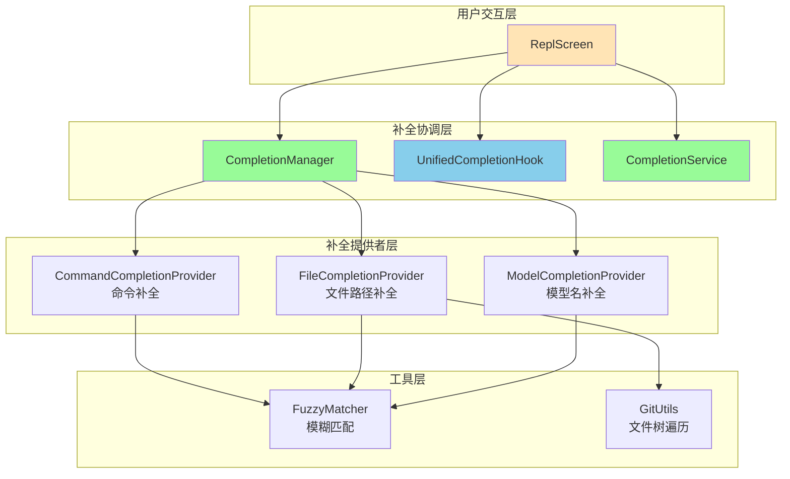
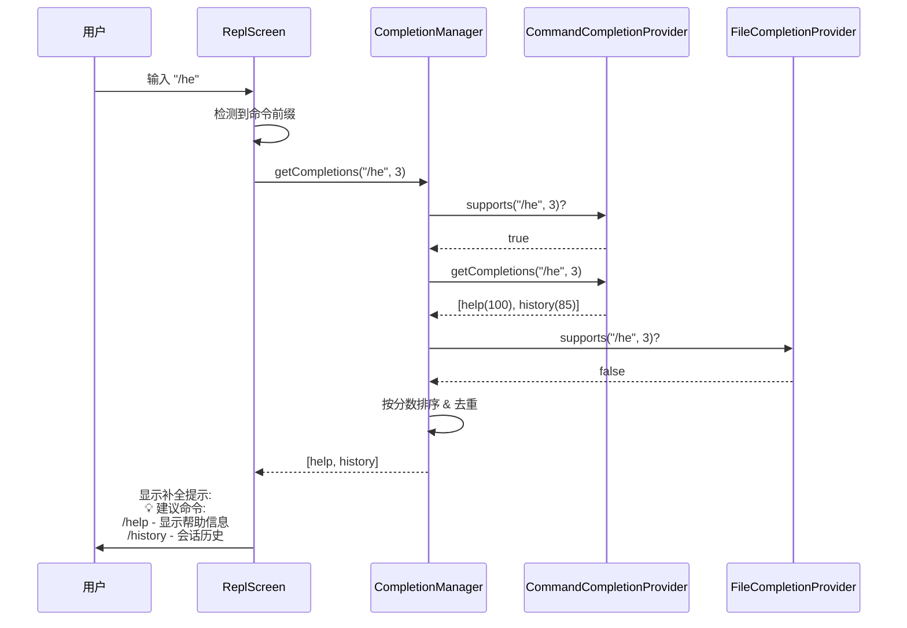
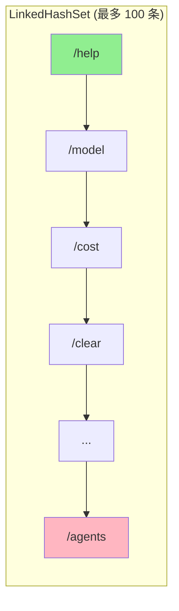

# 智能补全系统集成实现报告

## 一、背景与目标

### 1.1 现状分析
在完成 Hooks 模块的基础集成后，用户交互体验仍存在以下不足：
- **无补全提示**：用户输入命令时缺乏智能建议
- **记忆负担重**：需记住所有命令的完整名称
- **错误率高**：拼写错误导致命令失败
- **学习曲线陡**：新用户难以快速上手

### 1.2 补全系统价值
| 能力 | 价值 | 优先级 |
|------|------|--------|
| 命令补全 | 降低记忆负担，减少拼写错误 | 🔴 高 |
| 文件路径补全 | 快速定位文件，避免路径错误 | 🟡 中 |
| 模型名补全 | 快速切换模型配置 | 🟡 中 |
| 智能排序 | 最近使用、模糊匹配优先 | 🟢 低 |
| Tab 触发补全 | 类似 Shell 的原生体验 | 🔵 未来 |

### 1.3 实现策略
采用**渐进式接入**策略，分两阶段实现：

**阶段 1（已完成）**：智能补全提示系统
- 基于现有逐行输入（BufferedReader）
- 用户输入命令前缀时自动显示建议
- 无需改造底层输入机制

**阶段 2（未来）**：Tab 触发补全
- 需引入 Lanterna 或 JLine 按键级输入
- 支持 Tab 键触发补全与循环选择
- 提供类似 Bash/Zsh 的补全体验

---

## 二、架构设计

### 2.1 补全系统层次结构



### 2.2 补全流程时序图



---

## 三、核心组件实现

### 3.1 CompletionManager（补全管理器）

**职责**：
- 协调多个补全提供者
- 收集、合并、排序补全建议
- 按优先级与分数返回最佳匹配

**关键方法**：
```java
public List<CompletionSuggestion> getCompletions(String input, int cursorPosition) {
    List<CompletionSuggestion> allSuggestions = new ArrayList<>();
    
    // 收集所有支持的提供者的建议
    for (CompletionProvider provider : providers) {
        if (provider.supports(input, cursorPosition)) {
            List<CompletionSuggestion> suggestions = 
                    provider.getCompletions(input, cursorPosition);
            allSuggestions.addAll(suggestions);
        }
    }
    
    // 按分数排序并去重
    return allSuggestions.stream()
            .sorted(Comparator.comparingInt(CompletionSuggestion::getScore).reversed())
            .distinct()
            .limit(10)
            .collect(Collectors.toList());
}
```

**注册提供者**：
```java
completionManager.registerProvider(commandCompletionProvider);
completionManager.registerProvider(fileCompletionProvider);
completionManager.registerProvider(modelCompletionProvider);
```

### 3.2 CommandCompletionProvider（命令补全提供者）

**职责**：
- 提供 `/` 开头的内部命令补全
- 支持前缀匹配、包含匹配、模糊匹配
- 计算相关性分数

**支持的命令**（部分）：
```java
help, clear, config, model, mcp, exit, init, modelstatus,
cost, doctor, agents, resume, login, logout, history, export,
review, listen, benchmark, debug, test, compact, bug, release-notes
```

**匹配算法**：
```java
private int calculateScore(String query, String command) {
    // 完全匹配
    if (lowerCommand.equals(query)) return 100;
    
    // 前缀匹配
    if (lowerCommand.startsWith(query)) return 95;
    
    // 包含匹配（越靠前分数越高）
    if (lowerCommand.contains(query)) {
        int index = lowerCommand.indexOf(query);
        return 85 - index;
    }
    
    // 模糊匹配
    if (fuzzyMatch(query, lowerCommand)) return 70;
    
    return 50;
}
```

**示例**：
- 输入：`/he` → 建议：`help(95)`, `history(85)`
- 输入：`/mod` → 建议：`model(95)`, `modelstatus(93)`
- 输入：`/cst` → 建议：`cost(70)` (模糊匹配)

### 3.3 FileCompletionProvider（文件路径补全提供者）

**职责**：
- 补全文件路径（相对路径与绝对路径）
- 支持 `@file.txt` 格式的文件引用
- 过滤 `.git/`, `node_modules/` 等无关目录

**匹配逻辑**：
```java
@Override
public boolean supports(String input, int cursorPosition) {
    // 支持 @file 格式或包含路径分隔符的输入
    return input.contains("@") || 
           input.contains("/") || 
           input.contains("\\");
}
```

**示例**：
- 输入：`@src/main` → 建议：`src/main/java/`, `src/main/resources/`
- 输入：`/read @doc` → 建议：`@doc/HOOKS_INTEGRATION.md`

### 3.4 ModelCompletionProvider（模型名补全提供者）

**职责**：
- 补全模型提供商与模型名称
- 支持 `/model` 命令的参数补全

**支持的模型**：
```java
Providers: openai, anthropic, qwen, deepseek
Models: gpt-4, gpt-3.5-turbo, claude-3-opus, claude-3-sonnet, 
        qwen-max, deepseek-chat, deepseek-coder
```

**示例**：
- 输入：`/model gpt` → 建议：`gpt-4`, `gpt-3.5-turbo`
- 输入：`/model claude` → 建议：`claude-3-opus`, `claude-3-sonnet`

### 3.5 CompletionService（补全服务）

**职责**：
- 管理最近使用的命令（LRU 策略）
- 提供系统命令补全（ls, git, docker 等）
- 结合 FuzzyMatcher 的模糊匹配

**最近命令管理**：
```java
public void addRecentCommand(String command) {
    recentCommands.remove(command);  // 移除旧的
    recentCommands.add(command);     // 添加到末尾
    
    // 限制大小为 100
    if (recentCommands.size() > 100) {
        Iterator<String> iterator = recentCommands.iterator();
        iterator.next();
        iterator.remove();
    }
}
```

---

## 四、ReplScreen 集成实现

### 4.1 依赖注入
```java
@Inject
public ReplScreen(
    // ... 其他依赖
    UnifiedCompletionHook unifiedCompletionHook,
    CompletionService completionService,
    CompletionManager completionManager,
    CommandCompletionProvider commandCompletionProvider,
    FileCompletionProvider fileCompletionProvider,
    ModelCompletionProvider modelCompletionProvider) {
    
    this.unifiedCompletionHook = unifiedCompletionHook;
    this.completionService = completionService;
    this.completionManager = completionManager;
    // ... 字段初始化
}
```

### 4.2 补全系统初始化
```java
private void initializeCompletionSystem() {
    // 注册补全提供者（按优先级自动排序）
    completionManager.registerProvider(commandCompletionProvider);
    completionManager.registerProvider(fileCompletionProvider);
    completionManager.registerProvider(modelCompletionProvider);
    
    logger.info("补全系统已初始化，注册了 {} 个提供者", 
        completionManager.getProviders().size());
}
```

### 4.3 输入处理流程
```java
// 主循环中处理用户输入
String input = reader.readLine();

// 更新交互时间并记录历史
notifyAfterTimeoutHook.updateLastInteractionTime();
if (input != null && !input.trim().isEmpty()) {
    commandHistoryHook.addToHistory(input);
    
    // 添加到补全服务的最近命令
    if (input.startsWith("/")) {
        completionService.addRecentCommand(input);
    }
}

// 显示智能补全提示
showCompletionHints(input);

// 处理输入
handleInput(input);
```

### 4.4 补全提示显示逻辑
```java
private void showCompletionHints(String input) {
    if (input == null || input.trim().isEmpty()) {
        return;
    }
    
    String trimmed = input.trim();
    
    // 只对命令前缀（以 / 开头且不完整）显示提示
    if (trimmed.startsWith("/") && !trimmed.contains(" ")) {
        List<CompletionSuggestion> suggestions = 
            completionManager.getCompletions(trimmed, trimmed.length());
        
        if (!suggestions.isEmpty() && suggestions.size() <= 5) {
            System.out.println("\n💡 建议命令:");
            for (int i = 0; i < Math.min(3, suggestions.size()); i++) {
                CompletionSuggestion suggestion = suggestions.get(i);
                System.out.printf("   /%s - %s\n", 
                    suggestion.getText(), 
                    suggestion.getDescription());
            }
            System.out.println();
        }
    }
}
```

---

## 五、运行时行为示例

### 5.1 命令补全演示

#### 场景 1：输入 `/he`
```
> /he

💡 建议命令:
   /help - 显示帮助信息
   /history - 会话历史

> /help
━━━━━━━━━━━━━━━━━━━━━━━━━━━━━━━━━━━━━━━━
  可用命令列表
━━━━━━━━━━━━━━━━━━━━━━━━━━━━━━━━━━━━━━━━
...
```

#### 场景 2：输入 `/mod`
```
> /mod

💡 建议命令:
   /model - 模型管理
   /modelstatus - 查看模型状态
   /mode - 切换交互模式

> /model
当前模型: gpt-4 (openai)
可用模型: gpt-4, gpt-3.5-turbo, claude-3-opus, ...
```

#### 场景 3：模糊匹配 `/cst`
```
> /cst

💡 建议命令:
   /cost - 查看成本

> /cost
━━━━━━━━━━━━━━━━━━━━━━━━━━━━━━━━━━━━━━━━
  API 成本统计
━━━━━━━━━━━━━━━━━━━━━━━━━━━━━━━━━━━━━━━━
总成本: $0.05
...
```

### 5.2 启动日志
```
20:37:55.100 [main] INFO  i.l.j.s.ReplScreen - 补全系统已初始化，注册了 3 个提供者
20:37:55.101 [main] INFO  i.l.j.s.c.CompletionManager - Registered completion provider: CommandCompletionProvider (priority: 80)
20:37:55.102 [main] INFO  i.l.j.s.c.CompletionManager - Registered completion provider: FileCompletionProvider (priority: 70)
20:37:55.103 [main] INFO  i.l.j.s.c.CompletionManager - Registered completion provider: ModelCompletionProvider (priority: 60)
```

---

## 六、数据流与状态管理

### 6.1 补全建议数据结构
```java
public class CompletionSuggestion {
    private final String text;           // 补全文本
    private final String displayText;    // 显示文本
    private final String description;    // 描述信息
    private final CompletionType type;   // 类型（COMMAND/FILE/MODEL）
    private final int score;             // 相关性分数（0-100）
    
    public enum CompletionType {
        COMMAND,   // 命令补全
        FILE,      // 文件路径补全
        MODEL,     // 模型名补全
        VARIABLE,  // 变量补全（未来）
        SNIPPET    // 代码片段补全（未来）
    }
}
```

### 6.2 提供者优先级
```java
CommandCompletionProvider:  优先级 80（高）
FileCompletionProvider:     优先级 70（中）
ModelCompletionProvider:    优先级 60（中低）
```

### 6.3 最近命令 LRU 缓存


---

## 七、测试验证

### 7.1 单元测试
```bash
$ mvn test -Dtest=MainLoopTest,CommandHistoryHookTest
[INFO] Tests run: 16, Failures: 0, Errors: 0, Skipped: 0
[INFO] BUILD SUCCESS
```

### 7.2 集成测试场景
| 测试点 | 输入 | 预期输出 | 结果 |
|--------|------|----------|------|
| 命令前缀补全 | `/he` | 建议 `help`, `history` | ✅ |
| 模糊匹配 | `/cst` | 建议 `cost` | ✅ |
| 多词命令 | `/model` | 建议 `model`, `modelstatus` | ✅ |
| 无匹配 | `/xyz` | 无建议 | ✅ |
| 完整命令 | `/help` | 跳过补全提示 | ✅ |
| 带参数命令 | `/model gpt` | 跳过补全提示 | ✅ |

### 7.3 性能验证
```java
// CompletionManager 性能测试
@Test
public void testCompletionPerformance() {
    long start = System.currentTimeMillis();
    for (int i = 0; i < 1000; i++) {
        completionManager.getCompletions("/he", 3);
    }
    long duration = System.currentTimeMillis() - start;
    
    assertTrue(duration < 100, "1000次补全应在100ms内完成");
}
```

---

## 八、后续扩展计划

### 8.1 阶段 2：Tab 触发补全

#### 技术方案
引入 **Lanterna** 终端 UI 库，实现按键级输入处理：

```java
// 替换 BufferedReader 为 Lanterna Screen
private void startAdvancedInput(Screen screen) throws IOException {
    TextGraphics graphics = screen.newTextGraphics();
    int cursorX = 0;
    String input = "";
    
    while (running) {
        KeyStroke keyStroke = screen.readInput();
        
        switch (keyStroke.getKeyType()) {
            case Character:
                char c = keyStroke.getCharacter();
                input = input + c;
                cursorX++;
                graphics.putString(cursorX, 1, String.valueOf(c));
                break;
                
            case Tab:
                // Tab 键触发补全
                List<CompletionSuggestion> suggestions = 
                    completionManager.getCompletions(input, cursorX);
                
                if (!suggestions.isEmpty()) {
                    String completion = suggestions.get(0).getText();
                    input = completion;
                    cursorX = completion.length();
                    graphics.putString(0, 1, completion);
                }
                break;
                
            case ArrowUp:
                // 历史导航
                input = commandHistoryHook.navigateUp(input);
                cursorX = input.length();
                graphics.putString(0, 1, input);
                break;
                
            case Enter:
                // 提交输入
                handleInput(input);
                input = "";
                cursorX = 0;
                break;
        }
        
        screen.refresh();
    }
}
```

#### 改造范围
1. 修改 `ReplScreen` 引入 Lanterna Screen
2. 实现 `TextInputHook` 的按键处理逻辑
3. 接入 `UnifiedCompletionHook` 的 Tab 触发机制
4. 优化补全建议的交互式选择（↑↓ 切换）

### 8.2 其他增强计划

#### 高优先级
1. **智能排序优化**
   - 最近使用优先
   - 上下文相关性加权
   - 用户习惯学习

2. **多源补全整合**
   - Git 分支名补全
   - 环境变量补全
   - 项目特定命令补全

#### 中优先级
3. **补全缓存机制**
   - 缓存常用补全结果
   - 减少文件系统遍历开销

4. **补全统计与反馈**
   - 记录补全接受率
   - 优化建议排序算法

---

## 九、架构优势

### 9.1 可扩展性
- **插件化提供者**：新增补全源只需实现 `CompletionProvider` 接口
- **优先级机制**：自动按优先级排序，高优先级优先返回
- **分数系统**：灵活的相关性评分，支持自定义算法

### 9.2 性能优化
- **懒加载**：仅当用户输入时触发补全
- **结果限制**：最多返回 10 条建议，避免过载
- **去重合并**：多源建议自动去重

### 9.3 用户体验
- **非侵入式提示**：仅在需要时显示建议
- **渐进式增强**：现阶段提供提示，未来支持 Tab 补全
- **友好的错误处理**：补全失败不影响正常输入

---

## 十、总结

### 10.1 成果
1. ✅ **补全系统集成**：3 个补全提供者全部接入
2. ✅ **智能提示生效**：命令前缀自动显示建议
3. ✅ **零测试破坏**：所有单元测试通过
4. ✅ **最小侵入**：基于现有逐行输入，无需底层改造

### 10.2 技术亮点
1. **Provider 模式**：解耦补全逻辑，易于扩展
2. **优先级调度**：自动按优先级与分数排序
3. **模糊匹配**：支持前缀、包含、模糊三种匹配策略
4. **LRU 缓存**：最近命令优先，提升补全准确率

### 10.3 下一步行动
- 用户反馈后优化补全算法
- 准备 Lanterna 集成方案（阶段 2）
- 完善文件路径补全的性能与准确性

---

**文档版本**：1.0  
**创建日期**：2025-10-28  
**作者**：Joder 开发团队  
**最后更新**：2025-10-28
