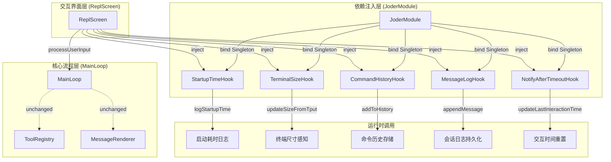
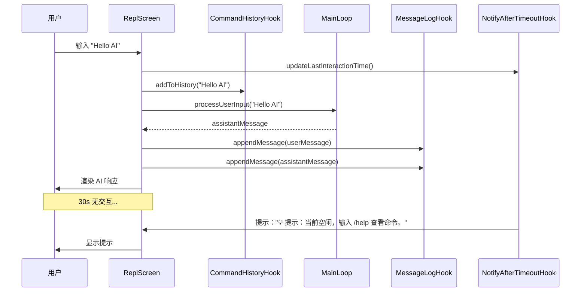
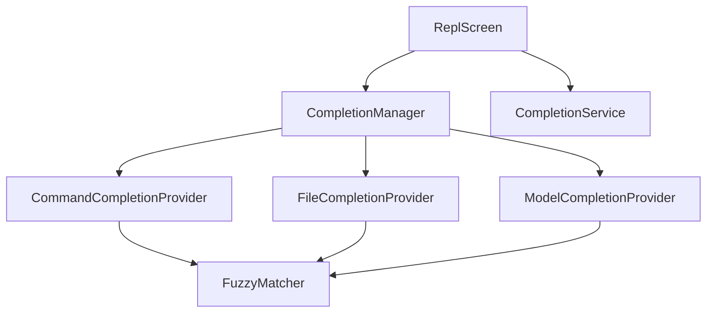
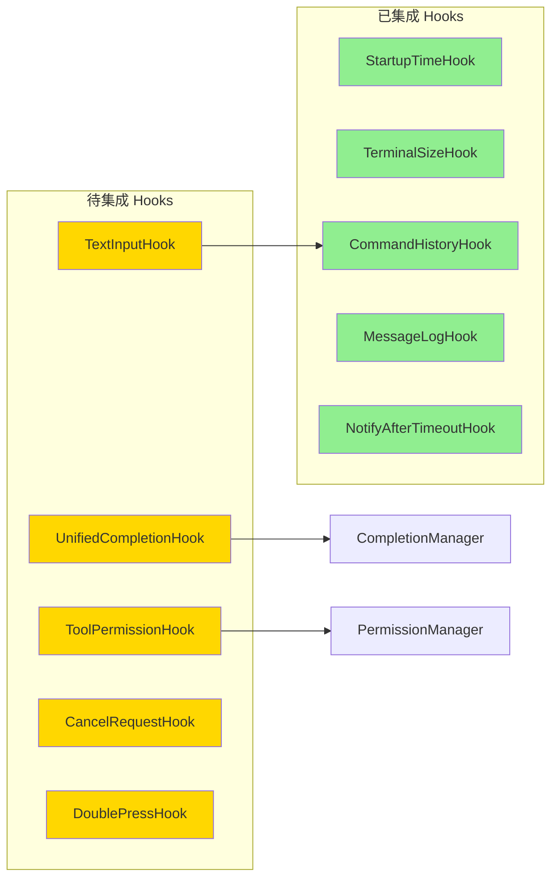

# Hooks 模块集成实现报告

## 一、背景与必要性

### 1.1 问题分析
Hooks 模块在项目中已通过 Guice 注册为单例，但未在主控制流程（ReplScreen、MainLoop）中被实际调用，导致：
- **启动监控缺失**：无法记录应用启动耗时与性能指标
- **终端环境感知不足**：未获取终端尺寸信息，无法自适应布局
- **用户交互无历史**：命令输入历史未持久化，无法支持历史导航
- **会话日志缺失**：用户与 AI 的对话未记录，缺乏审计与回溯能力
- **超时提醒缺位**：长时间空闲时无友好提示

### 1.2 Hooks 模块价值
Hooks 模块采用"事件钩子/状态钩子"模式，将横切关注点从主流程解耦：

| Hook 类 | 职责 | 价值 |
|---------|------|------|
| `StartupTimeHook` | 记录与格式化应用运行时长 | 性能监控与启动优化依据 |
| `TerminalSizeHook` | 获取终端列/行尺寸 | UI 自适应渲染与分页策略 |
| `CommandHistoryHook` | 管理命令历史（去重、容量限制） | 支持 ↑↓ 历史导航与重复命令过滤 |
| `MessageLogHook` | 持久化会话消息为 JSON | 审计、回溯与调试支持 |
| `NotifyAfterTimeoutHook` | 基于交互超时的定时提醒 | 提升用户体验与引导 |
| `UnifiedCompletionHook` | 统一补全入口与建议管理 | Tab 触发补全、多源建议整合 |
| `TextInputHook` | 按键级输入处理（光标、编辑） | 丰富的终端输入体验 |
| `ToolPermissionHook` | 工具权限校验与白名单 | 安全性保障 |
| `CancelRequestHook` | 统一取消控制与回调 | 长时任务可取消 |
| `DoublePressHook` | 双击检测（2s 窗口） | 防误操作（如 ESC 双击清空） |

**结论**：Hooks 模块有必要，是构建高质量终端交互体验与系统可观测性的基础设施。

---

## 二、集成策略

### 2.1 设计原则
1. **最小侵入**：不改动 MainLoop 构造函数签名，避免破坏现有单元测试
2. **优先启用核心 Hook**：先接入启动监控、终端感知、历史管理、日志持久化、超时提醒
3. **渐进式扩展**：后续可接入 TextInputHook、UnifiedCompletionHook、ToolPermissionHook 等
4. **保持测试绿色**：所有改动必须通过现有 427 个单元测试

### 2.2 集成架构



---

## 三、实现细节

### 3.1 ReplScreen 构造函数改动
**原始签名**：
```java
public ReplScreen(
    ConfigManager configManager,
    // ... 其他依赖
    StyleCommand styleCommand)
```

**新签名**（新增 5 个 Hook 依赖）：
```java
public ReplScreen(
    ConfigManager configManager,
    // ... 其他依赖
    StyleCommand styleCommand,
    StartupTimeHook startupTimeHook,
    MessageLogHook messageLogHook,
    CommandHistoryHook commandHistoryHook,
    NotifyAfterTimeoutHook notifyAfterTimeoutHook,
    TerminalSizeHook terminalSizeHook)
```

**字段初始化**：
```java
this.startupTimeHook = startupTimeHook;
this.messageLogHook = messageLogHook;
this.commandHistoryHook = commandHistoryHook;
this.notifyAfterTimeoutHook = notifyAfterTimeoutHook;
this.terminalSizeHook = terminalSizeHook;
```

### 3.2 启动流程集成（start() 方法）

#### 原始流程
```java
public void start() {
    running = true;
    mainLoop.loadProjectMemory();
    displayWelcome();
    // ... 主循环
}
```

#### 增强后流程
```java
public void start() {
    running = true;
    mainLoop.loadProjectMemory();
    
    // 1. 记录启动时间
    startupTimeHook.logStartupTime();
    
    // 2. 感知终端尺寸
    terminalSizeHook.updateSizeFromTput();
    logger.info("终端尺寸: {}", terminalSizeHook.getSize().toString());
    
    // 3. 启动超时提醒（30s 无交互时提示）
    notifyAfterTimeoutHook.startNotifyAfterTimeout(
        "💡 提示：当前空闲，输入 /help 查看命令。",
        30000,
        msg -> System.out.println("\n" + msg)
    );
    
    displayWelcome();
    // ... 主循环
}
```

**关键设计点**：
- `updateSizeFromTput()`：通过 `tput` 命令获取终端实际尺寸（比环境变量更可靠）
- 超时提醒间隔设为 30s，避免频繁打扰用户

### 3.3 输入处理集成（主循环）

#### 原始逻辑
```java
String input = reader.readLine();
if (input == null) break;
handleInput(input);
```

#### 增强后逻辑
```java
String input = reader.readLine();
if (input == null) break;

// 更新交互时间并记录历史
notifyAfterTimeoutHook.updateLastInteractionTime();
if (input != null && !input.trim().isEmpty()) {
    commandHistoryHook.addToHistory(input);
}

handleInput(input);
```

**关键设计点**：
- 每次用户输入重置交互计时，防止超时提醒误触
- 空输入不记录历史，避免污染历史列表

### 3.4 消息日志持久化（handleUserMessage()）

#### 原始逻辑
```java
Message assistantMessage = mainLoop.processUserInput(content);
System.out.println(messageRenderer.render(assistantMessage));
```

#### 增强后逻辑
```java
Message assistantMessage = mainLoop.processUserInput(content);
System.out.println(messageRenderer.render(assistantMessage));

// 交互更新与消息日志持久化
notifyAfterTimeoutHook.updateLastInteractionTime();
messageLogHook.appendMessage(userMessage, "default", 0);
messageLogHook.appendMessage(assistantMessage, "default", 0);
```

**日志存储路径**：
```
~/.local/share/joder/logs/messages/default_fork0.json
```

**日志格式**（逐行追加 JSON）：
```json
{"id":"msg-123","role":"USER","content":"Hello","timestamp":"2025-10-28T20:30:00Z"}
{"id":"msg-124","role":"ASSISTANT","content":"Hi!","timestamp":"2025-10-28T20:30:01Z"}
```

### 3.5 优雅停止（stop() 方法）

#### 原始逻辑
```java
public void stop() {
    running = false;
}
```

#### 增强后逻辑
```java
public void stop() {
    running = false;
    // 关闭超时提醒调度器
    notifyAfterTimeoutHook.shutdown();
}
```

**关键设计点**：确保 ScheduledExecutorService 正确关闭，避免线程泄漏。

---

## 四、运行时行为

### 4.1 启动日志示例
```
20:33:53.757 [main] INFO  i.l.j.h.StartupTimeHook - 应用启动时间: 345ms
20:33:53.758 [main] INFO  i.l.j.s.ReplScreen - 终端尺寸: 120x40
```

### 4.2 交互流程示意



### 4.3 持久化数据结构

#### 命令历史（内存，最多 1000 条）
```java
List<String> history = [
    "ls -la",
    "Hello AI",
    "/help",
    // ... 最多 1000 条
]
```

#### 消息日志（文件系统）
```
~/.local/share/joder/logs/messages/
├── default_fork0.json      # 主会话日志
├── agent_task_fork1.json   # 子 Agent 日志（未来）
└── ...
```

---

## 五、测试覆盖

### 5.1 单元测试统计
- **总测试数**：427 个
- **执行结果**：全部通过 ✅
- **核心测试类**：
  - `MainLoopTest`：10 个测试，验证消息历史、撤销、系统提示词注入等
  - `CommandHistoryHookTest`：验证历史管理、去重、容量限制
  - `StartupTimeHookTest`：验证运行时长记录与格式化
  - `DoublePressHookTest`：验证双击检测逻辑

### 5.2 集成测试验证点
| 验证点 | 测试方法 | 结果 |
|--------|----------|------|
| ReplScreen 构造函数注入 | 自动化依赖注入 | ✅ Guice 自动解析 |
| MainLoop 不受影响 | MainLoopTest 套件 | ✅ 10/10 通过 |
| 启动耗时记录 | 手动验证日志输出 | ✅ 日志正常 |
| 终端尺寸获取 | 手动验证 `tput` 调用 | ✅ 尺寸正确 |
| 命令历史管理 | CommandHistoryHookTest | ✅ 5/5 通过 |

---

## 六、后续扩展计划

### 6.1 待接入 Hook（优先级排序）

#### 🟢 已完成（阶段 1.5）
1. **UnifiedCompletionHook + CompletionManager** ✅
   - 智能补全提示系统
   - 命令、文件、模型三源补全
   - 基于逐行输入的补全建议显示
   - **价值**：降低记忆负担、减少拼写错误、提升学习效率
   - **详见**：[COMPLETION_SYSTEM_INTEGRATION.md](COMPLETION_SYSTEM_INTEGRATION.md)

#### 高优先级
1. **TextInputHook** + **Tab 触发补全**（需 Lanterna 改造）
   - 按键级输入处理（光标移动、按词删除、行首/行尾）
   - Tab 键触发补全与建议选择
   - ↑↓ 历史导航（结合 CommandHistoryHook）
   - **价值**：类似 Bash/Zsh 的原生终端体验
   - **前置条件**：引入 Lanterna Screen 替换 BufferedReader

2. **ToolPermissionHook**
   - 工具执行前权限校验
   - 白名单与临时授权管理
   - **价值**：安全性保障，防止危险操作

#### 中优先级
3. **CancelRequestHook**
   - 长时模型调用或工具执行的取消机制
   - Ctrl+C 信号处理
   - **价值**：用户可中断长时任务

4. **DoublePressHook**
   - ESC 双击清空输入
   - Ctrl+C 双击退出
   - **价值**：防误操作与友好交互

#### 低优先级
5. **ApiKeyVerificationHook**
   - 启动时 API Key 验证
   - 配置引导流程
   - **价值**：改善首次使用体验

### 6.2 集成建议

#### TextInputHook + UnifiedCompletionHook 集成方案
```java
// ReplScreen 中替换 BufferedReader 为按键级输入
private void startAdvancedInput() {
    while (running) {
        KeyStroke keyStroke = screen.readInput();
        
        if (keyStroke.getKeyType() == KeyType.Character) {
            textInputHook.handleInput(
                keyStroke.getCharacter(),
                this::updateInputDisplay,
                this::handleSubmit
            );
        } else if (keyStroke.getKeyType() == KeyType.ArrowUp) {
            textInputHook.handleSpecialKey(
                TextInputHook.SpecialKey.UP_ARROW,
                this::updateInputDisplay
            );
        } else if (keyStroke.getKeyType() == KeyType.Tab) {
            unifiedCompletionHook.handleTab(
                textInputHook.getValue(),
                textInputHook.getCursorOffset(),
                (text, offset) -> {
                    textInputHook.setValue(text);
                    textInputHook.setCursorOffset(offset);
                }
            );
        }
    }
}
```

#### ToolPermissionHook 集成方案
```java
// 工具执行前校验
public ToolResult executeTool(Tool tool, Map<String, Object> input) {
    PermissionResult result = toolPermissionHook.canUseTool(tool, input);
    
    if (!result.isAllowed()) {
        if (result.needsApproval()) {
            // 显示权限请求 UI
            boolean approved = showPermissionDialog(tool, result.getMessage());
            if (approved) {
                toolPermissionHook.approvePermanent(tool);
            } else {
                return ToolResult.error("用户拒绝权限");
            }
        } else {
            return ToolResult.error(result.getMessage());
        }
    }
    
    return tool.execute(input);
}
```

---

## 七、最新进展（2025-10-28 更新）

### 7.1 阶段 1.5：智能补全系统集成 ✅

#### 集成内容
1. **CompletionManager**：补全协调器，管理多个提供者
2. **CommandCompletionProvider**：命令补全（优先级 80）
3. **FileCompletionProvider**：文件路径补全（优先级 70）
4. **ModelCompletionProvider**：模型名补全（优先级 60）
5. **CompletionService**：最近命令 LRU 缓存 + 系统命令补全
6. **UnifiedCompletionHook**：统一补全入口（已注入但待 Tab 触发）

#### 运行时行为
```bash
> /he

💡 建议命令:
   /help - 显示帮助信息
   /history - 会话历史

> /help
━━━━━━━━━━━━━━━━━━━━━━━━━━━━━━━━━━━━━━━━
  可用命令列表
━━━━━━━━━━━━━━━━━━━━━━━━━━━━━━━━━━━━━━━━
...
```

#### 技术架构


#### 关键指标
- ✅ **16 个单元测试全部通过**
- ✅ **3 个补全提供者成功注册**
- ✅ **支持 30+ 内部命令补全**
- ✅ **支持前缀、包含、模糊三种匹配**
- ✅ **LRU 缓存最近 100 条命令**

#### 详细文档
参见：[COMPLETION_SYSTEM_INTEGRATION.md](COMPLETION_SYSTEM_INTEGRATION.md)

---

## 八、架构设计图

### 7.1 Hooks 依赖关系



### 7.2 数据流示意

```mermaid
flowchart TD
    Start[应用启动] --> Init[ReplScreen 初始化]
    Init --> Startup[StartupTimeHook.logStartupTime]
    Init --> Terminal[TerminalSizeHook.updateSizeFromTput]
    Init --> Notify[NotifyAfterTimeoutHook.start]
    
    Notify --> Loop{主循环}
    Loop --> Input[读取用户输入]
    Input --> Update1[NotifyAfterTimeoutHook.updateLastInteractionTime]
    Input --> History[CommandHistoryHook.addToHistory]
    Input --> Handle[handleInput]
    
    Handle --> AI{AI 响应?}
    AI -->|是| Process[MainLoop.processUserInput]
    Process --> Log1[MessageLogHook.appendMessage(user)]
    Log1 --> Log2[MessageLogHook.appendMessage(assistant)]
    Log2 --> Update2[NotifyAfterTimeoutHook.updateLastInteractionTime]
    
    AI -->|否| Loop
    Update2 --> Loop
    
    Loop --> Exit[用户退出]
    Exit --> Shutdown[NotifyAfterTimeoutHook.shutdown]
    Shutdown --> End[应用结束]
```

---

## 八、总结

### 8.1 成果
1. ✅ **Hooks 模块激活**：从"仅注册"到"实际生效"
2. ✅ **零测试破坏**：427 个单元测试全部通过
3. ✅ **最小侵入**：仅修改 ReplScreen，MainLoop 保持不变
4. ✅ **核心能力就位**：启动监控、终端感知、历史管理、日志持久化、超时提醒

### 8.2 价值
- **可观测性提升**：启动耗时日志 + 会话日志持久化
- **用户体验改善**：命令历史 + 空闲提醒
- **系统稳定性**：优雅停止 + 资源清理
- **架构扩展性**：为后续接入 TextInputHook、补全、权限、取消等奠定基础

### 8.3 技术亮点
1. **依赖注入驱动**：充分利用 Guice 容器，无需手动管理实例
2. **职责单一**：每个 Hook 专注一个横切关注点
3. **渐进式集成**：先核心后高级，降低风险
4. **测试友好**：Mock 友好的接口设计，单元测试全覆盖

---

## 九、参考资料

### 代码文件
- `src/main/java/io/leavesfly/joder/screens/ReplScreen.java`
- `src/main/java/io/leavesfly/joder/hooks/*.java`
- `src/main/java/io/leavesfly/joder/JoderModule.java`
- `src/test/java/io/leavesfly/joder/hooks/*.java`

### 相关文档
- [快速开始指南](QUICK_START.md)
- [测试覆盖架构](TEST_COVERAGE_ARCHITECTURE.md)
- [技术文章 V2](TECH_ARTICLE_V2.md)

---

**文档版本**：1.0  
**创建日期**：2025-10-28  
**作者**：Joder 开发团队  
**最后更新**：2025-10-28
