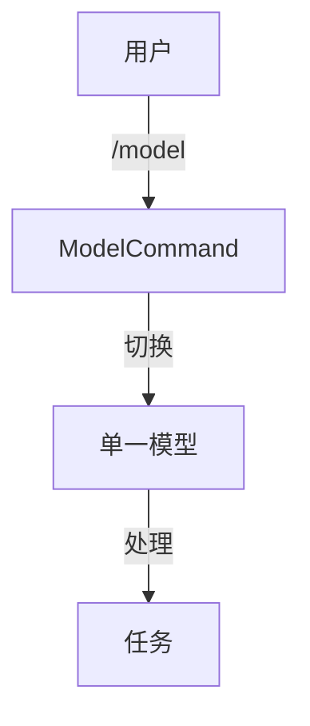

# Joder vs Kode 功能差异深度分析与补全路线图

**生成时间**: 2025-10-28  
**版本对比**: Kode v1.1.23 (TypeScript) vs Joder v1.0.0 (Java 17)

---

## 📊 执行摘要

Joder 是 Kode 的 Java 实现版本，当前**整体完成度约 55%**。核心基础设施和 MCP 集成已完成，但在工具完整性和高级功能方面存在差距。

### 完成度概览

| 模块 | Kode | Joder | 完成度 | 状态 |
|------|------|-------|--------|------|
| 基础设施 | ✅ | ✅ | 100% | ⭐⭐⭐⭐⭐ |
| 工具系统 | 20工具 | 9工具 | 45% | ⭐⭐☆☆☆ |
| 命令系统 | 24命令 | 11命令 | 46% | ⭐⭐☆☆☆ |
| 模型协作 | 高级 | 基础 | 60% | ⭐⭐⭐☆☆ |
| MCP集成 | ✅ | ✅ | 100% | ⭐⭐⭐⭐⭐ |
| 权限控制 | ✅ | ✅ | 100% | ⭐⭐⭐⭐⭐ |

---

## 1️⃣ 工具系统对比 (20 vs 9)

### ✅ 已完成工具 (9个)

#### 文件操作类 (7个) - 100% 完成
1. **FileReadTool** ✅ - 读取文件内容
2. **FileEditTool** ✅ - 搜索替换编辑
3. **FileWriteTool** ✅ - 创建/覆盖文件
4. **MultiEditTool** ✅ - 批量编辑
5. **GlobTool** ✅ - 文件模式匹配
6. **LSTool** ✅ - 目录列表
7. **GrepTool** ✅ - 内容搜索

#### 其他类别
8. **BashTool** ✅ - Shell 命令执行
9. **MCPTool** ✅ - MCP 工具适配

---

### ❌ 缺失工具 (11个)

#### P1 高优先级 (3个) - 建议 1 周内完成

##### 1. TodoWriteTool - 任务管理
```java
// 功能: 管理 AI 生成的任务列表
// 操作: add_tasks, update_tasks
// 数据结构:
class Task {
    String id;           // 唯一ID
    String content;      // 任务描述
    TaskStatus status;   // PENDING/IN_PROGRESS/COMPLETE/CANCELLED/ERROR
    String parentId;     // 支持子任务
}

// 实现要点:
1. 任务持久化到内存或文件
2. 支持任务状态流转
3. REPL 中实时显示任务进度
4. 集成到 REPL UI 显示任务列表
```

**工作量**: 1 天

---

##### 2. ThinkTool - 思考工具
```java
// 功能: AI 显式思考过程（内部推理）
// 特点: 输出不显示给用户，仅用于 AI 链式推理

public class ThinkTool extends AbstractTool {
    @Override
    public String getName() { return "think"; }
    
    @Override
    public ToolResult execute(Map<String, Object> params) {
        String thought = (String) params.get("thought");
        logger.debug("AI Thought: {}", thought);
        // 不返回给用户，仅记录日志
        return ToolResult.silent(); // 静默结果
    }
}
```

**用途**: 
- 复杂任务分解时的中间推理
- 多步骤规划
- 问题诊断分析

**工作量**: 0.5 天

---

##### 3. WebSearchTool - 网络搜索
```java
// 技术方案: DuckDuckGo HTML Search (无需 API Key)

public class WebSearchTool extends AbstractTool {
    @Override
    public ToolResult execute(Map<String, Object> params) {
        String query = (String) params.get("query");
        
        // 1. 构建 DuckDuckGo URL
        String url = "https://html.duckduckgo.com/html/?q=" 
            + URLEncoder.encode(query, "UTF-8");
        
        // 2. 获取 HTML
        String html = httpClient.get(url);
        
        // 3. 使用 Jsoup 解析结果
        Document doc = Jsoup.parse(html);
        List<SearchResult> results = doc.select(".result").stream()
            .limit(5)
            .map(this::parseResult)
            .collect(Collectors.toList());
        
        return ToolResult.success(results);
    }
}

// 依赖添加 (pom.xml):
<dependency>
    <groupId>org.jsoup</groupId>
    <artifactId>jsoup</artifactId>
    <version>1.17.2</version>
</dependency>
```

**工作量**: 1 天

---

#### P2 中优先级 (5个) - 建议 2 周内完成

##### 4. URLFetcherTool - 网页内容获取
```java
// 功能: 获取网页并转换为 Markdown

public class URLFetcherTool extends AbstractTool {
    @Override
    public ToolResult execute(Map<String, Object> params) {
        String url = (String) params.get("url");
        
        // 1. 获取 HTML
        String html = httpClient.get(url);
        
        // 2. 使用 Jsoup 清理内容
        Document doc = Jsoup.parse(html);
        doc.select("script, style, nav, footer, ads").remove();
        
        // 3. 提取主要内容
        Element mainContent = doc.select("article, main, .content").first();
        
        // 4. 转换为 Markdown
        String markdown = htmlToMarkdown(mainContent);
        
        return ToolResult.success(markdown);
    }
}
```

**工作量**: 1 天

---

##### 5-6. MemoryReadTool & MemoryWriteTool - 项目记忆系统
```java
// 存储结构: ~/.joder/memory/{project_hash}/memories.json
{
  "memories": [
    {
      "id": "mem_001",
      "title": "项目技术栈",
      "content": "使用 Spring Boot 3.0 + Maven",
      "keywords": ["spring-boot", "maven"],
      "category": "project_tech_stack",
      "scope": "workspace",
      "created_at": "2025-10-28T10:00:00Z"
    }
  ]
}

// 核心组件
public class MemoryManager {
    public List<Memory> search(String query) {
        // 基于关键词搜索
        // 未来可升级为向量检索
    }
    
    public void save(Memory memory) {
        // 保存到 JSON 文件
    }
}

public class MemoryReadTool extends AbstractTool {
    @Inject private MemoryManager memoryManager;
    
    @Override
    public ToolResult execute(Map<String, Object> params) {
        String query = (String) params.get("query");
        return ToolResult.success(memoryManager.search(query));
    }
}
```

**工作量**: 2 天

---

##### 7. AskExpertModelTool - 专家模型咨询
```java
// 功能: 在对话中临时咨询其他模型

public class AskExpertModelTool extends AbstractTool {
    @Inject private ModelAdapterFactory modelFactory;
    
    @Override
    public ToolResult execute(Map<String, Object> params) {
        String modelName = (String) params.get("model");  // "o3"
        String question = (String) params.get("question");
        
        // 1. 创建专用 ModelAdapter
        ModelAdapter expert = modelFactory.create(modelName);
        
        // 2. 发送问题（独立会话）
        ModelResponse response = expert.sendMessage(
            List.of(Message.user(question))
        );
        
        // 3. 返回专家回答
        return ToolResult.success(response.getContent());
    }
}

// 使用场景:
// 用户: "用 o3 模型分析这个算法的时间复杂度"
// AI: [调用 AskExpertModelTool(model="o3", question="...")]
// o3: "该算法时间复杂度为 O(n²)..."
```

**工作量**: 1.5 天

---

##### 8. ArchitectTool - 架构设计工具
```java
// 功能: 辅助系统架构设计和文档生成

public class ArchitectTool extends AbstractTool {
    @Override
    public ToolResult execute(Map<String, Object> params) {
        String task = (String) params.get("task");
        
        switch (task) {
            case "analyze_structure":
                // 分析项目结构
                return analyzeProjectStructure();
            case "generate_diagram":
                // 生成架构图（Mermaid 格式）
                return generateArchitectureDiagram();
            case "suggest_patterns":
                // 推荐设计模式
                return suggestDesignPatterns();
        }
    }
}
```

**工作量**: 2 天

---

#### P3 低优先级 (3个) - 可后续实现

##### 9-10. NotebookReadTool & NotebookEditTool
```java
// 功能: Jupyter Notebook 支持

public class NotebookReadTool extends AbstractTool {
    @Override
    public ToolResult execute(Map<String, Object> params) {
        String path = (String) params.get("path");
        
        // 使用 Jackson 解析 .ipynb (JSON 格式)
        NotebookFile notebook = objectMapper.readValue(
            new File(path), 
            NotebookFile.class
        );
        
        // 提取代码单元格
        List<String> cells = notebook.getCells().stream()
            .filter(c -> "code".equals(c.getType()))
            .map(Cell::getSource)
            .collect(Collectors.toList());
        
        return ToolResult.success(cells);
    }
}
```

**缺失原因**: Java 生态中 Notebook 使用较少  
**工作量**: 1.5 天

---

### 工具系统总结

| 优先级 | 数量 | 工具列表 | 预估工作量 |
|-------|------|---------|----------|
| P1 高 | 3 | TodoWrite, Think, WebSearch | 2.5 天 |
| P2 中 | 5 | URLFetch, Memory×2, AskExpert, Architect | 7.5 天 |
| P3 低 | 3 | Notebook×2, 其他 | 2 天 |
| **总计** | **11** | - | **12 天** |

---

## 2️⃣ 命令系统对比 (24 vs 11)

### ✅ 已实现命令 (11个)

#### 基础命令 (6个)
1. `/help` ✅ - 帮助信息
2. `/clear` ✅ - 清空屏幕
3. `/config` ✅ - 配置管理
4. `/model` ✅ - 模型切换
5. `/mcp` ✅ - MCP 管理
6. `/exit` ✅ - 退出程序

#### 其他命令 (5个)
7. `/cost` ✅ - 成本统计
8. `/doctor` ✅ - 系统诊断
9. `/login` ✅ - 账户登录
10. `/agents` ✅ - 代理管理
11. `/resume` ✅ - 恢复会话

---

### ❌ 缺失命令 (13个)

#### P1 高优先级 (2个)

##### 1. /init - 项目初始化
```java
public class InitCommand implements Command {
    @Override
    public CommandResult execute(String[] args) {
        Path projectRoot = Paths.get(".").toAbsolutePath();
        
        // 1. 创建 .joder/ 目录
        Files.createDirectories(projectRoot.resolve(".joder"));
        
        // 2. 生成默认配置
        Config defaultConfig = Config.empty()
            .withValue("joder.theme", "dark")
            .withValue("joder.language", "zh-CN");
        
        writeConfig(projectRoot.resolve(".joder/config.conf"), defaultConfig);
        
        // 3. 添加到 .gitignore
        appendToGitignore(".joder/");
        
        // 4. 扫描项目生成上下文
        scanProjectContext();
        
        return CommandResult.success("项目初始化完成 ✓");
    }
}
```

**工作量**: 0.5 天

---

##### 2. /modelstatus - 模型状态展示
```java
public class ModelStatusCommand implements Command {
    @Inject private ModelPointerManager pointerManager;
    @Inject private ModelRegistry modelRegistry;
    
    @Override
    public CommandResult execute(String[] args) {
        // 显示所有配置的模型及其状态
        
        StringBuilder output = new StringBuilder();
        output.append("模型配置状态:\n\n");
        
        // 1. 显示模型指针
        output.append("模型指针:\n");
        output.append(String.format("  main:      %s\n", pointerManager.get(MAIN)));
        output.append(String.format("  task:      %s\n", pointerManager.get(TASK)));
        output.append(String.format("  reasoning: %s\n", pointerManager.get(REASONING)));
        output.append(String.format("  quick:     %s\n\n", pointerManager.get(QUICK)));
        
        // 2. 显示所有模型
        output.append("已配置模型:\n");
        modelRegistry.getAllProfiles().forEach(profile -> {
            output.append(String.format("  %-20s %s (%s)\n", 
                profile.getName(),
                profile.isActive() ? "✓" : "✗",
                profile.getProvider()
            ));
        });
        
        return CommandResult.success(output.toString());
    }
}
```

**工作量**: 0.5 天

---

#### P2 中优先级 (3个)

##### 3. /review - 代码审查
```java
public class ReviewCommand implements Command {
    @Inject private GitService gitService;
    @Inject private ModelAdapter modelAdapter;
    
    @Override
    public CommandResult execute(String[] args) {
        // 1. 获取当前变更
        GitDiff diff = gitService.getDiff();
        
        // 2. 构建审查 Prompt
        String prompt = """
            请审查以下代码变更，关注:
            1. 潜在 Bug 和逻辑错误
            2. 性能问题
            3. 安全漏洞
            4. 代码规范和最佳实践
            5. 测试覆盖
            
            ```diff
            %s
            ```
            """.formatted(diff.getContent());
        
        // 3. 发送给 AI
        ModelResponse response = modelAdapter.sendMessage(
            List.of(Message.user(prompt))
        );
        
        return CommandResult.success(response.getContent());
    }
}
```

**工作量**: 1 天

---

##### 4. /logout - 账户登出
```java
public class LogoutCommand implements Command {
    @Inject private ConfigManager configManager;
    
    @Override
    public CommandResult execute(String[] args) {
        // 清除 OAuth Token
        configManager.clearAuthToken();
        configManager.clearApiKeys(); // 可选
        
        return CommandResult.success("已登出 ShareAI 账户");
    }
}
```

**工作量**: 0.2 天

---

##### 5. /listen - 文件监听
```java
// 功能: 监听文件变化自动触发分析

public class ListenCommand implements Command {
    @Inject private FileWatchService watchService;
    @Inject private ModelAdapter modelAdapter;
    
    @Override
    public CommandResult execute(String[] args) {
        String pattern = args.length > 0 ? args[0] : "**/*.java";
        
        watchService.watch(pattern, event -> {
            // 文件变化时自动分析
            String prompt = String.format(
                "文件 %s 发生了变化:\n%s\n请分析影响范围和潜在问题",
                event.getPath(),
                event.getDiff()
            );
            
            modelAdapter.sendMessage(List.of(Message.user(prompt)));
        });
        
        return CommandResult.success("开始监听: " + pattern);
    }
}
```

**依赖**: Java NIO WatchService  
**工作量**: 1.5 天

---

#### P3 低优先级 (8个)

这些命令为增强功能，可在核心功能完成后逐步实现:

- `/compact` - 压缩输出模式
- `/ctx_viz` - 上下文可视化
- `/onboarding` - 新手引导
- `/pr_comments` - PR 评论生成
- `/bug` - Bug 报告
- `/release-notes` - 发布说明
- `/refreshCommands` - 刷新自定义命令
- `/terminalSetup` - 终端设置

**工作量**: 4 天

---

### 命令系统总结

| 优先级 | 数量 | 命令列表 | 预估工作量 |
|-------|------|---------|----------|
| P1 高 | 2 | init, modelstatus | 1 天 |
| P2 中 | 3 | review, logout, listen | 2.7 天 |
| P3 低 | 8 | 增强功能命令 | 4 天 |
| **总计** | **13** | - | **7.7 天** |

---

## 3️⃣ 核心功能模块对比

### 3.1 多模型协作系统

#### Kode 的实现

```mermaid
graph TB
    subgraph "Kode 多模型系统"
        User[用户] --> |Tab切换| MM[ModelManager]
        User --> |@ask-o3| AEM[AskExpertModelTool]
        User --> |@run-agent| TaskTool
        
        MM --> |管理| MP1[main指针]
        MM --> |管理| MP2[task指针]
        MM --> |管理| MP3[reasoning指针]
        MM --> |管理| MP4[quick指针]
        
        TaskTool --> |使用| Subagent1[Subagent 1]
        TaskTool --> |使用| Subagent2[Subagent 2]
        
        Subagent1 --> |模型| MP2
        Subagent2 --> |模型| MP2
        
        AEM --> |临时调用| Expert[专家模型]
    end
```

**核心特性**:
1. ✅ **模型指针系统** - 4 种用途的默认模型
2. ✅ **Tab 快速切换** - 交互式切换当前模型
3. ✅ **Subagent 并行** - 多个子任务并行处理
4. ✅ **专家咨询** - 临时调用特定模型

---

#### Joder 的实现



**已实现**:
- ✅ 基础模型切换
- ✅ 多提供商支持 (Anthropic/OpenAI/Qwen/DeepSeek)
- ✅ ModelAdapterFactory

**缺失**:
- ❌ 模型指针系统
- ❌ Tab 快速切换
- ❌ Subagent 多模型并行
- ❌ AskExpertModelTool

---

#### 补全方案

##### 1. 实现模型指针系统
```java
// 配置文件: .joder/config.conf
joder {
  model {
    pointers {
      main = "claude-3-sonnet"
      task = "qwen-coder"
      reasoning = "o3"
      quick = "glm-4.5"
    }
  }
}

// Java 实现
public class ModelPointerManager {
    public enum Pointer {
        MAIN,      // 主对话
        TASK,      // 子任务
        REASONING, // 复杂推理
        QUICK      // 快速响应
    }
    
    public ModelAdapter getModel(Pointer pointer) {
        String modelName = configManager.getPointer(pointer);
        return modelFactory.create(modelName);
    }
}
```

---

##### 2. 增强 TaskTool 支持多模型
```java
public class TaskTool extends AbstractTool {
    @Inject private ModelPointerManager pointerManager;
    
    @Override
    public ToolResult execute(Map<String, Object> params) {
        List<String> subtasks = (List) params.get("tasks");
        String modelName = (String) params.getOrDefault("model", null);
        
        // 决定使用哪个模型
        ModelAdapter taskModel = modelName != null
            ? modelFactory.create(modelName)  // 用户指定
            : pointerManager.getModel(TASK);  // 使用 task 指针
        
        // 并行执行子任务
        List<CompletableFuture<String>> futures = subtasks.stream()
            .map(task -> CompletableFuture.supplyAsync(() -> 
                executeSubtask(task, taskModel)
            ))
            .collect(Collectors.toList());
        
        // 等待所有子任务完成
        List<String> results = futures.stream()
            .map(CompletableFuture::join)
            .collect(Collectors.toList());
        
        return ToolResult.success(results);
    }
}
```

---

### 3.2 智能上下文补全

#### Kode 的实现

**核心功能**:
1. `@ask-model` - 咨询特定模型
2. `@run-agent` - 运行智能代理
3. `@file` - 引用文件
4. 模糊匹配 - `gp5` 匹配 `@ask-gpt-5`
5. 自动加前缀 - Tab/Enter 自动添加 `@`
6. 系统命令优化 - 500+ 常用命令数据库

---

#### Joder 状态

**当前**: ❌ 完全缺失

**补全方案**:

```java
// 1. 补全提供器接口
public interface CompletionProvider {
    List<Completion> getCompletions(String prefix);
    int getPriority();
}

// 2. 模型补全提供器
public class ModelCompletionProvider implements CompletionProvider {
    @Override
    public List<Completion> getCompletions(String prefix) {
        return modelRegistry.getAllProfiles().stream()
            .filter(p -> fuzzyMatch(p.getName(), prefix))
            .map(p -> new Completion(
                "@ask-" + p.getName(),
                "咨询 " + p.getName() + " 模型",
                CompletionType.MODEL
            ))
            .collect(Collectors.toList());
    }
}

// 3. 代理补全提供器
public class AgentCompletionProvider implements CompletionProvider {
    @Override
    public List<Completion> getCompletions(String prefix) {
        return agentRegistry.getAgents().stream()
            .filter(a -> fuzzyMatch(a.getName(), prefix))
            .map(a -> new Completion(
                "@run-agent-" + a.getName(),
                a.getDescription(),
                CompletionType.AGENT
            ))
            .collect(Collectors.toList());
    }
}

// 4. 文件补全提供器
public class FileCompletionProvider implements CompletionProvider {
    @Override
    public List<Completion> getCompletions(String prefix) {
        // 使用 Files.walk() 搜索匹配的文件
        return Files.walk(Paths.get("."))
            .filter(p -> fuzzyMatch(p.toString(), prefix))
            .limit(10)
            .map(p -> new Completion(
                "@" + p.toString(),
                "引用文件",
                CompletionType.FILE
            ))
            .collect(Collectors.toList());
    }
}

// 5. 补全管理器
public class CompletionManager {
    private final List<CompletionProvider> providers;
    
    public List<Completion> complete(String input) {
        return providers.stream()
            .sorted(Comparator.comparing(CompletionProvider::getPriority))
            .flatMap(p -> p.getCompletions(input).stream())
            .limit(10)
            .collect(Collectors.toList());
    }
}
```

**集成到 REPL**:
```java
// 使用 jline3 实现智能补全
LineReader reader = LineReaderBuilder.builder()
    .terminal(terminal)
    .completer(new CompletionAdapter(completionManager))
    .build();
```

**依赖添加**:
```xml
<dependency>
    <groupId>org.jline</groupId>
    <artifactId>jline</artifactId>
    <version>3.25.1</version>
</dependency>
```

**工作量**: 3-4 天

---

### 3.3 AGENTS.md 标准支持

#### Kode 的实现

**核心功能**:
1. ✅ 解析 AGENTS.md 文件
2. ✅ 兼容 CLAUDE.md 格式
3. ✅ `#` 命令生成文档
4. ✅ 代理自动加载

**代理定义示例**:
```markdown
## simplicity-auditor

审查代码过度工程问题，提倡简洁设计。

**Capabilities**: 
- 识别过度抽象
- 建议简化方案
- 评估复杂度

**Usage**: `@run-agent-simplicity-auditor [代码路径]`
```

---

#### Joder 状态

**当前**: ❌ 未实现

**补全方案**:

```java
// 1. 代理定义数据结构
public class AgentDefinition {
    private String name;
    private String description;
    private List<String> capabilities;
    private String usage;
    private String systemPrompt;
}

// 2. AGENTS.md 解析器
public class AgentsMarkdownParser {
    public List<AgentDefinition> parse(Path mdFile) {
        String content = Files.readString(mdFile);
        
        // 使用 flexmark-java 解析 Markdown
        MutableDataSet options = new MutableDataSet();
        Parser parser = Parser.builder(options).build();
        Node document = parser.parse(content);
        
        // 提取代理定义（## 标题）
        List<AgentDefinition> agents = new ArrayList<>();
        // ... 解析逻辑
        
        return agents;
    }
}

// 3. 代理注册表
public class AgentRegistry {
    private final Map<String, AgentDefinition> agents = new ConcurrentHashMap<>();
    
    public void loadFromFile(Path agentsFile) {
        List<AgentDefinition> defs = parser.parse(agentsFile);
        defs.forEach(def -> agents.put(def.getName(), def));
    }
    
    public Optional<AgentDefinition> getAgent(String name) {
        return Optional.ofNullable(agents.get(name));
    }
}

// 4. # 命令处理
public class HashCommandHandler {
    @Inject private AgentRegistry agentRegistry;
    
    public CommandResult handle(String input) {
        if (!input.startsWith("#")) {
            return CommandResult.notHandled();
        }
        
        String documentRequest = input.substring(1).trim();
        
        // 生成文档并追加到 AGENTS.md
        String generatedDoc = generateDocumentation(documentRequest);
        appendToAgentsFile(generatedDoc);
        
        return CommandResult.success("文档已更新到 AGENTS.md");
    }
}
```

**依赖添加**:
```xml
<dependency>
    <groupId>com.vladsch.flexmark</groupId>
    <artifactId>flexmark-all</artifactId>
    <version>0.64.8</version>
</dependency>
```

**工作量**: 2-3 天

---

## 4️⃣ 补全优先级路线图

### 🔴 Phase 1 - 核心工具补全 (1 周)

**目标**: 达到基本可用状态

| 任务 | 工作量 | 优先级 |
|------|-------|--------|
| TodoWriteTool | 1天 | P1 |
| ThinkTool | 0.5天 | P1 |
| WebSearchTool | 1天 | P1 |
| /init 命令 | 0.5天 | P1 |
| /modelstatus 命令 | 0.5天 | P1 |

**总计**: 3.5 天

---

### 🟡 Phase 2 - 高级功能 (2 周)

**目标**: 实现多模型协作和智能补全

| 任务 | 工作量 | 优先级 |
|------|-------|--------|
| 模型指针系统 | 1天 | P1 |
| 增强 TaskTool 多模型支持 | 1.5天 | P1 |
| AskExpertModelTool | 1.5天 | P2 |
| URLFetcherTool | 1天 | P2 |
| MemoryReadTool + MemoryWriteTool | 2天 | P2 |
| 智能上下文补全 | 3天 | P2 |
| /review 命令 | 1天 | P2 |

**总计**: 11 天

---

### 🟢 Phase 3 - 增强功能 (2 周)

**目标**: 补全剩余功能

| 任务 | 工作量 | 优先级 |
|------|-------|--------|
| AGENTS.md 标准支持 | 2.5天 | P2 |
| ArchitectTool | 2天 | P2 |
| /listen 命令 | 1.5天 | P2 |
| NotebookReadTool + NotebookEditTool | 1.5天 | P3 |
| 辅助命令 (8个) | 4天 | P3 |

**总计**: 11.5 天

---

### 🔵 Phase 4 - 优化与完善 (1 周)

**目标**: 性能优化和用户体验提升

| 任务 | 工作量 |
|------|-------|
| 性能优化（并发、缓存） | 2天 |
| UI/UX 改进（Lanterna 渲染） | 1.5天 |
| 单元测试补全 | 1.5天 |
| 文档完善 | 1天 |

**总计**: 6 天

---

## 📊 总体实施计划

| 阶段 | 持续时间 | 关键成果 | 完成度提升 |
|------|---------|---------|-----------|
| Phase 1 | 1周 | 核心工具可用 | 55% → 70% |
| Phase 2 | 2周 | 多模型协作 | 70% → 85% |
| Phase 3 | 2周 | 功能完整 | 85% → 95% |
| Phase 4 | 1周 | 优化完善 | 95% → 100% |
| **总计** | **6周** | **功能对等** | **55% → 100%** |

---

## 🎯 关键技术挑战与解决方案

### 挑战 1: UI 渲染差异

**问题**: Kode 使用 React (Ink)，Joder 使用 Lanterna  
**解决方案**:
- 使用 Lanterna 的 TerminalPane 实现类似组件化
- 参考 Kode 的 UI 布局设计，适配到 Lanterna API
- 实现自定义渲染器处理复杂布局

---

### 挑战 2: 异步处理模型

**问题**: TypeScript 的 async/await vs Java 的 CompletableFuture  
**解决方案**:
- 统一使用 CompletableFuture 处理异步操作
- 实现 Stream 式 API 处理流式响应
- 使用虚拟线程 (Java 21+) 优化并发性能（可选升级）

---

### 挑战 3: 依赖生态差异

**问题**: npm 生态丰富，Maven 可能缺少对应库  
**解决方案**:

| 功能 | Kode (npm) | Joder (Maven) 替代方案 |
|------|-----------|---------------------|
| Markdown解析 | marked | flexmark-java |
| HTML解析 | cheerio | jsoup |
| JSON处理 | 原生 | jackson |
| 终端UI | ink | lanterna |
| 补全 | - | jline3 |

---

## 💡 最佳实践建议

### 1. 代码组织
```
joder/src/main/java/io/shareai/joder/
├── tools/
│   ├── web/              # 网络工具
│   │   ├── WebSearchTool.java
│   │   └── URLFetcherTool.java
│   ├── memory/           # 记忆系统
│   │   ├── MemoryManager.java
│   │   ├── MemoryReadTool.java
│   │   └── MemoryWriteTool.java
│   └── notebook/         # Notebook 支持
├── services/
│   ├── completion/       # 补全系统
│   │   ├── CompletionManager.java
│   │   └── providers/
│   └── agents/           # 代理系统
│       ├── AgentRegistry.java
│       └── AgentsMarkdownParser.java
└── core/
    └── modelpointer/     # 模型指针
        └── ModelPointerManager.java
```

---

### 2. 测试策略
```java
// 每个新工具必须有单元测试
@Test
public void testWebSearchTool() {
    WebSearchTool tool = new WebSearchTool();
    ToolResult result = tool.execute(Map.of("query", "Java testing"));
    
    assertThat(result.isSuccess()).isTrue();
    assertThat(result.getData()).isNotEmpty();
}

// 集成测试验证端到端流程
@Test
public void testMultiModelCollaboration() {
    // 测试 TaskTool + Subagent + 模型指针
}
```

---

### 3. 性能优化
- 使用 LRU 缓存模型响应
- 实现请求去重（相同问题不重复调用）
- 异步加载项目上下文
- 延迟初始化非核心组件

---

## 📈 预期成果

### 功能对等性

完成所有阶段后，Joder 将达到与 Kode 的功能对等:

| 能力 | Kode | Joder (完成后) |
|------|------|---------------|
| 工具数量 | 20 | 20 ✅ |
| 命令数量 | 24 | 24 ✅ |
| 多模型协作 | ✅ | ✅ |
| 智能补全 | ✅ | ✅ |
| AGENTS.md | ✅ | ✅ |
| MCP 集成 | ✅ | ✅ |

---

### 性能指标

| 指标 | 目标 |
|------|------|
| 启动时间 | < 1s |
| 命令响应 | < 100ms |
| 模型切换 | < 500ms |
| 内存占用 | < 200MB |

---

## 📝 总结

### 当前状态
- ✅ 基础设施完善
- ✅ 核心文件工具完整 (100%)
- ⚠️ 高级工具缺失 (45%)
- ⚠️ 命令系统不完整 (46%)
- ❌ 智能功能未实现 (0%)

### 补全路径
1. **Phase 1** (1周): 核心工具 → 55% → 70%
2. **Phase 2** (2周): 多模型协作 → 70% → 85%
3. **Phase 3** (2周): 功能完整 → 85% → 95%
4. **Phase 4** (1周): 优化完善 → 95% → 100%

### 关键里程碑
- ✅ Week 1: P1 工具和命令完成
- ✅ Week 3: 多模型协作上线
- ✅ Week 5: 功能完整对等
- ✅ Week 6: 性能优化完成

---

**预计总工作量**: 6 周 (约 30 人·天)  
**建议团队规模**: 1-2 名 Java 开发者  
**预期完成时间**: 2025-12-09

---

*报告生成于 2025-10-28 by Qoder AI*
