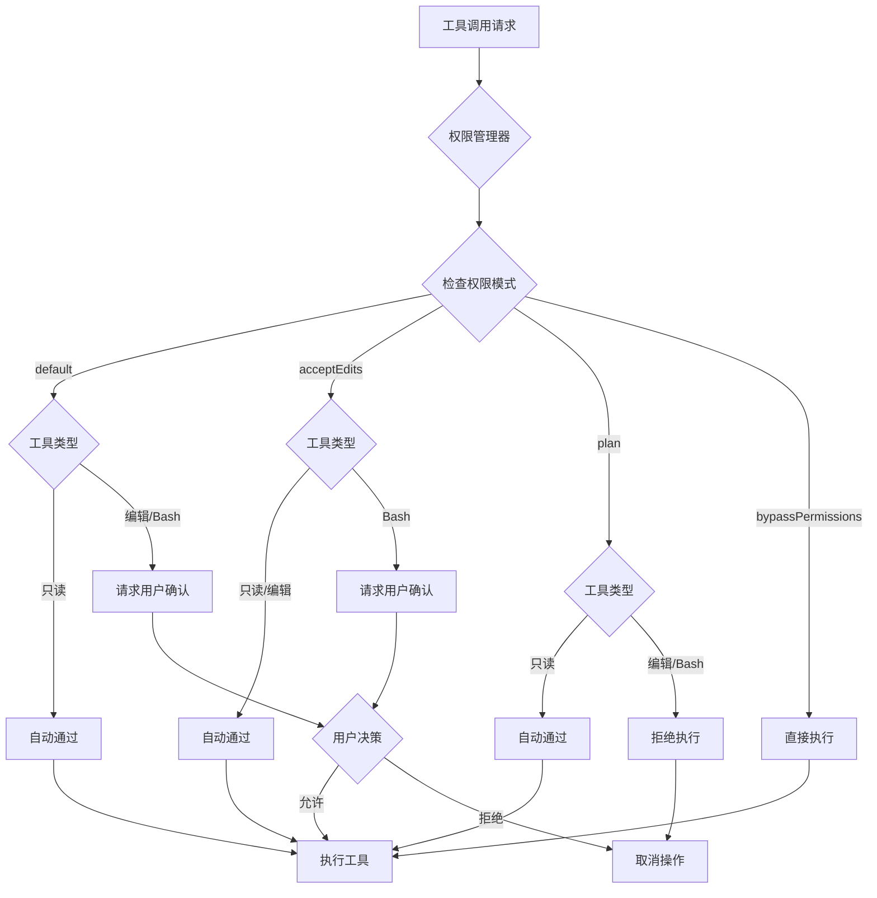
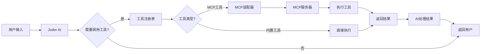

# Joder 快速入门指南

欢迎使用 Joder！本指南将帮助你快速上手这个强大的 AI 驱动终端助手工具。

## 📖 目录

- [环境准备](#环境准备)
- [安装步骤](#安装步骤)
- [基础配置](#基础配置)
- [第一次运行](#第一次运行)
- [基础使用](#基础使用)
- [常用功能](#常用功能)
- [进阶配置](#进阶配置)
- [权限管理详解](#权限管理详解)
- [MCP 服务器集成](#mcp-服务器集成)
- [Agent 使用指南](#agent-使用指南)
- [常见问题排查](#常见问题排查)
- [性能优化建议](#性能优化建议)
- [最佳实践](#最佳实践)
- [下一步](#下一步)

## 环境准备

在开始之前，请确保你的系统满足以下要求：

### 必需环境

- **Java Development Kit (JDK)**
  - 版本：Java 17 或更高
  - 验证安装：`java -version`
  - 下载地址：[Oracle JDK](https://www.oracle.com/java/technologies/downloads/) 或 [OpenJDK](https://openjdk.org/)

- **Apache Maven**
  - 版本：Maven 3.8 或更高
  - 验证安装：`mvn -version`
  - 下载地址：[Maven 官网](https://maven.apache.org/download.cgi)

### 支持的操作系统

- ✅ macOS (10.14+)
- ✅ Linux (大多数发行版)
- ✅ Windows 10/11

### 可选要求

- **Git**：用于克隆项目仓库
- **终端模拟器**：推荐使用支持 ANSI 颜色的现代终端（如 iTerm2、Windows Terminal）

## 安装步骤

### 方式一：从源码构建（推荐）

#### 1. 克隆项目

```bash
# 使用 HTTPS
git clone https://github.com/yourusername/joder.git

# 或使用 SSH
git clone git@github.com:yourusername/joder.git

# 进入项目目录
cd joder
```

#### 2. 构建项目

```bash
# 清理并构建
mvn clean package

# 跳过测试快速构建（首次构建不推荐）
mvn clean package -DskipTests
```

构建过程可能需要几分钟，Maven 会自动下载所需依赖。

**预期输出**：
```
[INFO] ------------------------------------------------------------------------
[INFO] BUILD SUCCESS
[INFO] ------------------------------------------------------------------------
[INFO] Total time:  01:23 min
[INFO] Finished at: 2024-01-15T10:30:00+08:00
[INFO] ------------------------------------------------------------------------
```

构建成功后，会在 `target/` 目录下生成可执行 JAR 文件：`joder-1.0.0.jar`

### 方式二：下载发布版本

从 [Releases 页面](https://github.com/yourusername/joder/releases) 下载最新版本的 JAR 文件。

## 基础配置

### 创建配置目录

```bash
# macOS/Linux
mkdir -p ~/.config/joder

# Windows PowerShell
New-Item -ItemType Directory -Force -Path "$env:USERPROFILE\.config\joder"
```

### 配置 API 密钥

Joder 需要 AI 模型的 API 密钥才能工作。你至少需要配置一个 AI 提供商。

#### 步骤 1：创建配置文件

```bash
# macOS/Linux
touch ~/.config/joder/config.conf

# Windows
# 使用记事本或其他编辑器创建文件
```

#### 步骤 2：编辑配置文件

打开 `~/.config/joder/config.conf`（Windows: `%USERPROFILE%\.config\joder\config.conf`），添加以下内容：

```hocon
joder {
  # ========================================
  # AI 模型配置
  # ========================================
  
  models {
    # Anthropic Claude（推荐）
    anthropic {
      api-key = "sk-ant-xxxxxxxxxxxx"  # 替换为你的 API Key
      base-url = "https://api.anthropic.com"
      timeout = 60
    }
    
    # OpenAI GPT
    openai {
      api-key = "sk-xxxxxxxxxxxx"  # 替换为你的 API Key
      base-url = "https://api.openai.com"
      timeout = 60
    }
    
    # 阿里云通义千问
    qwen {
      api-key = "sk-xxxxxxxxxxxx"  # 替换为你的 API Key
      base-url = "https://dashscope.aliyuncs.com"
      timeout = 60
    }
    
    # DeepSeek
    deepseek {
      api-key = "sk-xxxxxxxxxxxx"  # 替换为你的 API Key
      base-url = "https://api.deepseek.com"
      timeout = 60
    }
  }
  
  # ========================================
  # 默认模型
  # ========================================
  # 可选值：claude-3-sonnet, gpt-4o, qwen-max, deepseek-chat 等
  default-model = "claude-3-sonnet"
  
  # ========================================
  # 权限模式
  # ========================================
  # strict  - 严格模式：所有危险操作需手动确认
  # relaxed - 宽松模式：仅首次执行时确认
  # auto    - 自动模式：完全自动化（需谨慎使用）
  permission-mode = "strict"
  
  # ========================================
  # UI 配置
  # ========================================
  # 可选主题：dark, light, nord, monokai
  theme = "dark"
  
  # 语言设置：zh_CN（中文）, en_US（英文）
  language = "zh_CN"
}
```

#### 步骤 3：获取 API 密钥

**Anthropic Claude**（推荐）：
1. 访问 [Anthropic Console](https://console.anthropic.com/)
2. 注册账号并登录
3. 在 API Keys 页面创建新的 API 密钥
4. 将密钥复制到配置文件的 `anthropic.api-key` 字段

**OpenAI GPT**：
1. 访问 [OpenAI Platform](https://platform.openai.com/)
2. 登录后进入 API Keys 页面
3. 创建新的 API 密钥
4. 将密钥复制到配置文件的 `openai.api-key` 字段

**阿里云通义千问**：
1. 访问 [阿里云 DashScope](https://dashscope.console.aliyun.com/)
2. 开通服务并创建 API Key
3. 将密钥复制到配置文件的 `qwen.api-key` 字段

**DeepSeek**：
1. 访问 [DeepSeek Platform](https://platform.deepseek.com/)
2. 注册并创建 API Key
3. 将密钥复制到配置文件的 `deepseek.api-key` 字段

> **提示**：你不需要配置所有提供商，配置一个即可开始使用。

#### 使用环境变量（可选）

你也可以使用环境变量来管理 API 密钥：

```hocon
joder.models.anthropic.api-key = ${ANTHROPIC_API_KEY}
joder.models.openai.api-key = ${OPENAI_API_KEY}
joder.models.qwen.api-key = ${QWEN_API_KEY}
joder.models.deepseek.api-key = ${DEEPSEEK_API_KEY}
```

然后在系统中设置环境变量：

```bash
# macOS/Linux（添加到 ~/.bashrc 或 ~/.zshrc）
export ANTHROPIC_API_KEY="sk-ant-xxxxxxxxxxxx"
export OPENAI_API_KEY="sk-xxxxxxxxxxxx"

# Windows PowerShell
$env:ANTHROPIC_API_KEY="sk-ant-xxxxxxxxxxxx"
$env:OPENAI_API_KEY="sk-xxxxxxxxxxxx"
```

## 第一次运行

### 启动 Joder

#### 使用 JAR 文件（推荐）

```bash
# 在项目根目录下
java -jar target/joder-1.0.0.jar
```

#### 使用 Maven

```bash
mvn exec:java -Dexec.mainClass="io.leavesfly.joder.JoderApplication"
```

#### 使用启动脚本

```bash
# macOS/Linux
chmod +x bin/joder.sh
./bin/joder.sh

# Windows
bin\joder.bat
```

### 首次启动

成功启动后，你会看到 Joder 的欢迎界面：

```
     __  ____  ____  __________ 
    / / / __ \/ __ \/ ____/ __ \
 __/ / / / / / / / / __/ / /_/ /
/ __/ / /_/ / /_/ / /___/ _, _/ 
\___/_\____/_____/_____/_/ |_|  
                                
🚀 AI-Powered Terminal Assistant
Version: 1.0.0 | Java 17

📋 快速帮助:
  输入消息开始对话
  使用 /help 查看命令列表
  使用 /model 切换 AI 模型
  按 Ctrl+C 退出

>
```

### 验证配置

输入以下命令检查配置：

```
> /doctor
```

这会运行系统诊断，检查：
- API 密钥配置状态
- 模型可用性
- 配置文件加载情况
- 系统环境信息

## 基础使用

### 简单对话

直接输入问题，开始与 AI 对话：

```
> 你好，请介绍一下自己

[AI 回复]
你好！我是 Joder，一个 AI 驱动的智能终端助手。我可以帮助你完成各种任务：

🔧 我能做什么：
- 文件操作：创建、编辑、搜索文件
- 代码编写：生成代码、代码审查、重构
- 命令执行：运行 Bash 命令、系统管理
- 信息检索：网络搜索、文档查找
- 任务管理：创建待办、跟踪进度

💡 使用技巧：
- 使用 @ 符号引用文件：@README.md
- 使用 /命令 执行内置命令
- 我会自动调用工具完成任务

有什么我可以帮你的吗？
```

### 切换模型

查看当前模型：

```
> /model
```

切换到其他模型：

```
> /model gpt-4o
✅ 已切换到模型：gpt-4o

> /model deepseek-chat
✅ 已切换到模型：deepseek-chat
```

### 查看帮助

```
> /help
```

会显示所有可用命令的列表和说明。

## 常用功能

### 1. 文件操作

#### 创建文件

```
> 帮我创建一个 Python 脚本 hello.py，打印 Hello, World!

[AI 自动调用 file_edit 工具]
✅ 文件已创建：/path/to/hello.py

已创建 Python 脚本 hello.py，内容如下：
```python
print("Hello, World!")
```
```

#### 读取文件

使用 `@` 符号引用文件：

```
> 查看 @hello.py 的内容

[AI 读取文件并显示]
文件 hello.py 的内容：
```python
print("Hello, World!")
```

这是一个简单的 Python 脚本，功能是打印 "Hello, World!" 到控制台。
```

#### 编辑文件

```
> 修改 @hello.py，让它打印当前时间

[AI 自动修改文件]
✅ 文件已修改：hello.py

已更新脚本，现在会打印当前时间：
```python
from datetime import datetime

print(f"Hello, World! 当前时间：{datetime.now()}")
```
```

### 2. 代码搜索

#### 搜索文件内容

```
> 在当前项目中搜索包含 "TODO" 的 Java 文件

[AI 调用 grep 工具]
🔍 找到 5 个匹配项：

📄 src/main/java/io/leavesfly/joder/tools/ToolRegistry.java:42
   // TODO: 实现工具热重载功能

📄 src/main/java/io/leavesfly/joder/services/model/ModelAdapter.java:87
   // TODO: 添加流式响应支持
...
```

#### 查看目录结构

```
> 显示 src/main/java 的目录结构

[AI 调用 file_tree 工具]
📁 src/main/java/io/leavesfly/joder/
├── cli/
│   ├── commands/
│   ├── Command.java
│   └── CommandParser.java
├── core/
│   ├── config/
│   └── permission/
...
```

### 3. 命令执行

```
> 查看当前目录有哪些文件

[AI 调用 bash 工具]
$ ls -la
total 64
drwxr-xr-x  15 user  staff   480 Jan 15 10:30 .
drwxr-xr-x   8 user  staff   256 Jan 15 09:00 ..
-rw-r--r--   1 user  staff  1234 Jan 15 10:30 README.md
...
```

### 4. 网络搜索

```
> 搜索一下 Java 17 的新特性

[AI 调用 web_search 工具]
🌐 正在搜索：Java 17 新特性

找到以下相关信息：

1. **密封类（Sealed Classes）**
   - 限制哪些类可以继承或实现
   - 提供更好的封装性

2. **模式匹配增强**
   - instanceof 模式匹配
   - switch 表达式改进
...
```

### 5. 任务管理

```
> 帮我创建一个待办任务：完成项目文档

[AI 调用 task_add 工具]
✅ 已创建任务：
- ID: task-001
- 内容：完成项目文档
- 状态：待处理

> 查看所有任务

[AI 调用 task_list 工具]
📋 待办任务列表：

1. [待处理] 完成项目文档 (task-001)
```

### 6. 多文件引用

使用 `@` 可以同时引用多个文件：

```
> 对比 @src/main/java/Main.java 和 @src/test/java/MainTest.java 的区别

[AI 读取两个文件并分析]
我已读取两个文件，主要区别如下：

1. **Main.java**：应用程序主入口
   - 包含 main() 方法
   - 负责启动应用

2. **MainTest.java**：单元测试
   - 使用 JUnit 框架
   - 测试 Main 类的功能
...
```

## 进阶配置

### 完整配置详解

#### 模型配置深入

Joder 支持多种 AI 模型提供商，每个提供商可配置多个模型：

```hocon
joder {
  models {
    # Anthropic Claude 系列
    anthropic {
      api-key = "${ANTHROPIC_API_KEY}"
      base-url = "https://api.anthropic.com"
      timeout = 60  # 请求超时时间（秒）
      
      # 可用模型
      available-models = [
        "claude-3-opus-20240229",
        "claude-3-sonnet-20240229",
        "claude-3-haiku-20240307"
      ]
      
      # 模型参数调优
      model-params {
        temperature = 0.7      # 创造性程度 (0.0-1.0)
        max-tokens = 4096      # 最大输出长度
        top-p = 0.9           # 核采样参数
      }
    }
    
    # OpenAI GPT 系列
    openai {
      api-key = "${OPENAI_API_KEY}"
      base-url = "https://api.openai.com"
      timeout = 60
      
      available-models = [
        "gpt-4o",
        "gpt-4-turbo",
        "gpt-3.5-turbo"
      ]
      
      model-params {
        temperature = 0.7
        max-tokens = 4096
        top-p = 1.0
        frequency-penalty = 0.0  # 频率惩罚
        presence-penalty = 0.0   # 存在惩罚
      }
    }
    
    # 阿里云通义千问
    qwen {
      api-key = "${QWEN_API_KEY}"
      base-url = "https://dashscope.aliyuncs.com"
      timeout = 60
      
      available-models = [
        "qwen-max",
        "qwen-plus",
        "qwen-turbo"
      ]
    }
    
    # DeepSeek
    deepseek {
      api-key = "${DEEPSEEK_API_KEY}"
      base-url = "https://api.deepseek.com"
      timeout = 60
      
      available-models = [
        "deepseek-chat",
        "deepseek-coder"
      ]
    }
  }
  
  # 默认模型选择
  default-model = "claude-3-sonnet-20240229"
  
  # 模型切换策略
  model-fallback = true  # 启用失败自动切换
  fallback-order = [     # 切换顺序
    "claude-3-sonnet-20240229",
    "gpt-4o",
    "deepseek-chat"
  ]
}
```

#### UI 主题定制

Joder 支持多种预设主题和自定义主题：

```hocon
joder {
  ui {
    # 主题选择: dark, light, nord, monokai, solarized
    theme = "dark"
    
    # 自定义颜色方案
    custom-theme {
      background = "#1e1e1e"
      foreground = "#d4d4d4"
      primary = "#007acc"
      secondary = "#6a9955"
      error = "#f44747"
      warning = "#dcdcaa"
      success = "#4ec9b0"
    }
    
    # 语法高亮配置
    syntax-highlighting {
      enabled = true
      theme = "monokai"  # 代码高亮主题
    }
    
    # 界面布局
    layout {
      show-line-numbers = true
      show-git-status = true
      compact-mode = false
    }
  }
}
```

#### 工具配置

```hocon
joder {
  tools {
    # 文件操作工具配置
    file {
      max-file-size = 10485760  # 10MB
      allowed-extensions = ["*"]  # 允许所有扩展名
      excluded-patterns = [      # 排除模式
        "*.class",
        "*.jar",
        "node_modules/**",
        ".git/**"
      ]
    }
    
    # Bash 执行工具配置
    bash {
      timeout = 30              # 命令超时（秒）
      working-directory = "."   # 工作目录
      shell = "/bin/bash"       # Shell 路径
      
      # 危险命令黑名单
      blacklist = [
        "rm -rf /",
        "dd if=/dev/zero",
        ":(){ :|:& };:"
      ]
    }
    
    # 搜索工具配置
    search {
      max-results = 100
      case-sensitive = false
      use-regex = true
    }
    
    # Web 搜索配置
    web {
      enabled = true
      search-engine = "google"  # google, bing, duckduckgo
      max-results = 5
      timeout = 10
    }
  }
}
```

#### 性能与缓存配置

```hocon
joder {
  performance {
    # 缓存配置
    cache {
      enabled = true
      max-size = 1000           # 最大缓存条目数
      ttl = 3600                # 生存时间（秒）
      cache-directory = "~/.cache/joder"
    }
    
    # 并发配置
    concurrency {
      max-threads = 10
      tool-timeout = 60
    }
    
    # 日志配置
    logging {
      level = "INFO"  # TRACE, DEBUG, INFO, WARN, ERROR
      file = "~/.config/joder/logs/joder.log"
      max-file-size = "10MB"
      max-history = 30  # 保留天数
    }
  }
}
```

### 项目级配置

除了全局配置（`~/.config/joder/config.conf`），你还可以为每个项目创建独立配置：

```bash
# 在项目根目录创建配置
mkdir -p .joder
touch .joder/config.conf
```

项目配置会覆盖全局配置，适合团队协作场景：

```hocon
# .joder/config.conf
joder {
  # 项目特定的默认模型
  default-model = "claude-3-sonnet-20240229"
  
  # 项目权限模式
  permissions {
    mode = "default"
    
    # 项目可信工具
    trustedTools = [
      "file_read",
      "file_write",
      "bash_execute"
    ]
    
    # 文件系统白名单
    fileSystemWhitelist = [
      "src/**",
      "test/**",
      "docs/**"
    ]
  }
  
  # 项目特定的 Agent
  agents {
    java-expert {
      model = "claude-3-sonnet-20240229"
      system-prompt = "你是一个 Java 17 专家，熟悉本项目的架构和代码规范。"
      tools = ["file_read", "file_write", "grep", "bash_execute"]
    }
  }
}
```

### 环境变量配置

所有配置项都支持通过环境变量覆盖：

```bash
# API 密钥
export ANTHROPIC_API_KEY="sk-ant-xxxx"
export OPENAI_API_KEY="sk-xxxx"
export QWEN_API_KEY="sk-xxxx"
export DEEPSEEK_API_KEY="sk-xxxx"

# 运行时配置
export JODER_DEFAULT_MODEL="gpt-4o"
export JODER_PERMISSION_MODE="strict"
export JODER_THEME="nord"
export JODER_LANGUAGE="zh_CN"

# 调试选项
export JODER_LOG_LEVEL="DEBUG"
export JODER_ENABLE_PROFILING="true"
```

## 权限管理详解

Joder 提供了四种权限模式，以平衡自动化效率和安全性。

### 权限模式对比

| 模式 | 说明 | 只读工具 | 编辑工具 | Bash 执行 | 适用场景 |
|------|------|----------|----------|-----------|----------|
| **default** | 默认模式 | ✅ 自动通过 | ⚠️ 需确认 | ⚠️ 需确认 | 日常使用 |
| **acceptEdits** | 接受编辑 | ✅ 自动通过 | ✅ 自动通过 | ⚠️ 需确认 | 可信环境 |
| **plan** | 计划模式 | ✅ 自动通过 | ❌ 禁止 | ❌ 禁止 | 方案规划 |
| **bypassPermissions** | 绕过权限 | ✅ 自动通过 | ✅ 自动通过 | ✅ 自动通过 | 调试/演示 |

### 权限模式架构



### 详细配置示例

#### 1. 默认模式（推荐）

适合日常开发使用，平衡安全性和便利性：

```hocon
joder {
  permissions {
    mode = "default"
    
    # 可信工具列表（这些工具即使在 default 模式也自动通过）
    trustedTools = [
      "file_read",
      "file_tree",
      "grep",
      "web_search"
    ]
    
    # 文件系统白名单（只能操作这些路径）
    fileSystemWhitelist = [
      "${user.home}/projects/**",
      "${user.home}/workspace/**"
    ]
    
    # 文件系统黑名单（禁止访问）
    fileSystemBlacklist = [
      "/etc/**",
      "/usr/**",
      "/System/**",
      "${user.home}/.ssh/**"
    ]
  }
}
```

**使用场景**：
- 首次使用 Joder
- 在不熟悉的项目中工作
- 处理敏感数据时

#### 2. 接受编辑模式

自动批准文件编辑操作，提高效率：

```hocon
joder {
  permissions {
    mode = "acceptEdits"
    
    # 即使在此模式，仍需确认的命令
    dangerousCommands = [
      "rm",
      "dd",
      "mkfs",
      "format"
    ]
  }
}
```

**使用场景**：
- 在自己的项目中快速开发
- 进行大量文件重构
- 可信环境下的批量操作

**⚠️ 注意**：此模式下 AI 可以自动修改文件，使用前请确保项目已做版本控制（Git）。

#### 3. 计划模式

只允许只读操作，适合方案设计阶段：

```hocon
joder {
  permissions {
    mode = "plan"
    
    # 允许的只读工具
    allowedTools = [
      "file_read",
      "file_tree",
      "grep",
      "search",
      "web_search"
    ]
  }
}
```

**使用场景**：
- 代码审查
- 项目分析
- 学习新项目结构
- 生成技术方案文档

#### 4. 绕过权限模式

完全自动化，**仅用于调试和演示**：

```hocon
joder {
  permissions {
    mode = "bypassPermissions"
    
    # 记录所有操作
    audit-log = true
    audit-file = "~/.config/joder/logs/audit.log"
  }
}
```

**⚠️ 警告**：此模式存在安全风险，AI 可以执行任何操作，请谨慎使用！

### 运行时权限切换

可以在运行时临时切换权限模式：

```bash
# 查看当前权限模式
> /permission
当前权限模式: default

# 切换到计划模式
> /permission plan
✅ 已切换到权限模式: plan

# 临时绕过权限（需确认）
> /permission bypass
⚠️  警告: 绕过权限模式存在安全风险！
是否确认切换? (y/N): y
✅ 已切换到权限模式: bypassPermissions
```

### 白名单与黑名单配置

#### 工具白名单

只允许使用指定工具：

```hocon
joder {
  permissions {
    mode = "default"
    
    # 启用工具白名单
    useToolWhitelist = true
    
    toolWhitelist = [
      "file_read",
      "file_write",
      "file_tree",
      "grep",
      "search"
    ]
  }
}
```

#### 路径白名单

限制文件操作范围：

```hocon
joder {
  permissions {
    fileSystemWhitelist = [
      # 工作项目
      "/Users/username/projects/**",
      
      # 临时目录
      "${java.io.tmpdir}/joder/**",
      
      # 文档目录
      "${user.home}/Documents/dev/**"
    ]
    
    fileSystemBlacklist = [
      # 系统目录
      "/etc/**",
      "/usr/**",
      "/bin/**",
      "/sbin/**",
      
      # 敏感配置
      "${user.home}/.ssh/**",
      "${user.home}/.aws/**",
      "${user.home}/.config/joder/config.conf"
    ]
  }
}
```

### 权限审计

启用权限审计以跟踪所有操作：

```hocon
joder {
  permissions {
    # 启用审计日志
    audit {
      enabled = true
      log-file = "~/.config/joder/logs/audit.log"
      
      # 审计级别: all, denied, approved
      level = "all"
      
      # 包含详细信息
      include-details = true
    }
  }
}
```

审计日志示例：

```
[2024-01-15 10:30:45] APPROVED file_write: src/main/java/Main.java (user: john, mode: default)
[2024-01-15 10:31:12] DENIED bash_execute: rm -rf temp/* (user: john, mode: plan)
[2024-01-15 10:32:03] APPROVED file_read: config/application.conf (user: john, mode: default)
```

## MCP 服务器集成

MCP (Model Context Protocol) 允许 Joder 集成外部工具和服务，极大扩展了功能边界。

### 什么是 MCP？

MCP 是一个开放协议，允许 AI 助手连接到外部工具服务器。通过 MCP，Joder 可以：
- 访问文件系统、数据库、API
- 集成第三方服务（GitHub、Slack、Jira 等）
- 使用自定义业务工具

### MCP 服务器配置

#### 添加 MCP 服务器

在配置文件中添加 MCP 服务器：

```hocon
joder {
  mcp {
    servers {
      # 文件系统服务器
      filesystem {
        command = "npx"
        args = [
          "-y",
          "@modelcontextprotocol/server-filesystem",
          "/path/to/workspace"
        ]
        enabled = true
        
        # 环境变量
        env {
          NODE_ENV = "production"
        }
      }
      
      # GitHub 服务器
      github {
        command = "npx"
        args = [
          "-y",
          "@modelcontextprotocol/server-github"
        ]
        enabled = true
        
        env {
          GITHUB_TOKEN = "${GITHUB_TOKEN}"
        }
      }
      
      # Postgres 数据库服务器
      postgres {
        command = "npx"
        args = [
          "-y",
          "@modelcontextprotocol/server-postgres"
        ]
        enabled = false
        
        env {
          POSTGRES_URL = "postgresql://localhost:5432/mydb"
        }
      }
      
      # 自定义 MCP 服务器
      custom-server {
        command = "python"
        args = [
          "/path/to/custom_mcp_server.py"
        ]
        enabled = true
      }
    }
  }
}
```

### MCP 服务器管理

#### 列出所有服务器

```bash
> /mcp list

📋 MCP 服务器列表:

  🟢 filesystem [运行中]
    命令: npx
    参数: -y, @modelcontextprotocol/server-filesystem, /workspace
    
  ⚪ github [已禁用]
    命令: npx
    参数: -y, @modelcontextprotocol/server-github
    
  🔴 postgres [已停止]
    命令: npx
    参数: -y, @modelcontextprotocol/server-postgres

💡 可用命令:
  /mcp start <name>   - 启动服务器
  /mcp stop <name>    - 停止服务器
  /mcp enable <name>  - 启用服务器
  /mcp disable <name> - 禁用服务器
  /mcp tools [name]   - 列出工具
```

#### 启动和停止服务器

```bash
# 启动服务器
> /mcp start github
✅ GitHub 服务器已启动

# 停止服务器
> /mcp stop github
✅ GitHub 服务器已停止

# 重新加载配置
> /mcp reload
✅ 已重新加载 MCP 配置
```

#### 列出可用工具

```bash
> /mcp tools

🔧 可用 MCP 工具:

📁 filesystem 服务器:
  - read_file: 读取文件内容
  - write_file: 写入文件
  - list_directory: 列出目录
  - create_directory: 创建目录

🐙 github 服务器:
  - create_issue: 创建 Issue
  - list_issues: 列出 Issues
  - create_pull_request: 创建 PR
  - merge_pull_request: 合并 PR
```

### 使用 MCP 工具

MCP 工具会自动集成到 Joder 中，AI 会根据需要调用：

```bash
> 帮我在 GitHub 上创建一个 Issue，标题是 "修复登录 Bug"

[AI 自动调用 MCP github 服务器的 create_issue 工具]
✅ 已创建 Issue #123: 修复登录 Bug
🔗 https://github.com/user/repo/issues/123
```

### MCP 架构流程



### 常用 MCP 服务器

#### 1. 文件系统服务器

提供高级文件操作：

```bash
npm install -g @modelcontextprotocol/server-filesystem
```

**功能**：
- 读写文件（支持大文件）
- 目录操作
- 文件搜索
- 监听文件变化

#### 2. GitHub 服务器

与 GitHub 交互：

```bash
npm install -g @modelcontextprotocol/server-github
```

**功能**：
- Issue 管理
- Pull Request 操作
- 仓库管理
- Code Review

#### 3. Slack 服务器

团队协作：

```bash
npm install -g @modelcontextprotocol/server-slack
```

**功能**：
- 发送消息
- 频道管理
- 文件分享

#### 4. 数据库服务器

数据库操作：

```bash
npm install -g @modelcontextprotocol/server-postgres
npm install -g @modelcontextprotocol/server-mysql
```

**功能**：
- 执行查询
- 数据管理
- Schema 操作

### 开发自定义 MCP 服务器

创建自定义 MCP 服务器非常简单：

```python
# custom_mcp_server.py
from mcp.server import Server, Tool
import json

server = Server("custom-server")

@server.tool()
def my_custom_tool(param1: str, param2: int) -> str:
    """自定义工具描述"""
    # 实现你的逻辑
    return f"处理结果: {param1} - {param2}"

if __name__ == "__main__":
    server.run()
```

然后在配置中添加：

```hocon
joder.mcp.servers.custom {
  command = "python"
  args = ["/path/to/custom_mcp_server.py"]
  enabled = true
}
```

### MCP 故障排查

#### 服务器启动失败

**检查步骤**：

1. 验证命令路径：
```bash
which npx  # 或 which python
```

2. 测试命令：
```bash
npx -y @modelcontextprotocol/server-filesystem /tmp
```

3. 查看日志：
```bash
tail -f ~/.config/joder/logs/mcp-*.log
```

#### 工具调用失败

```bash
# 启用详细日志
> /debug on

# 重新启动服务器
> /mcp stop filesystem
> /mcp start filesystem

# 查看工具列表
> /mcp tools filesystem
```

## Agent 使用指南

Agent 是预配置的 AI 助手，具有特定的专业知识和工具权限。

### 内置 Agent

Joder 提供了多个内置 Agent：

#### 1. Code Writer（代码编写助手）

```bash
> @run-agent:code-writer 实现一个用户认证模块

[Code Writer Agent]
我将为你实现用户认证模块，包括以下功能：
1. 用户注册
2. 密码加密
3. 登录验证
4. Session 管理

[自动创建文件和代码]...
```

**特点**：
- 专注于代码编写
- 自动遵循最佳实践
- 包含单元测试

#### 2. Code Reviewer（代码审查助手）

```bash
> @run-agent:code-reviewer 审查 @src/main/java/AuthService.java

[Code Reviewer Agent]
📋 代码审查报告：

✅ 优点：
- 代码结构清晰
- 异常处理完善

⚠️ 建议：
- 第 45 行：建议使用 Optional 处理空值
- 第 67 行：可以提取为私有方法提高可读性

🔒 安全问题：
- 第 23 行：密码应使用 BCrypt 加密，而非 MD5
```

**特点**：
- 深度代码分析
- 安全审查
- 性能建议

#### 3. Architect（架构设计师）

```bash
> @run-agent:architect 设计一个电商系统的架构

[Architect Agent]
我将为你设计一个可扩展的电商系统架构：

[生成架构图和详细说明]...
```

**特点**：
- 系统架构设计
- 技术选型建议
- 可视化架构图

#### 4. Tech Writer（技术文档编写）

```bash
> @run-agent:tech-writer 为项目编写 API 文档

[Tech Writer Agent]
开始生成 API 文档...

[自动分析代码并生成文档]...
```

**特点**：
- 自动生成文档
- 规范化格式
- 包含示例代码

### 创建自定义 Agent

#### 方法一：配置文件方式

在 `~/.config/joder/config.conf` 或 `.joder/config.conf` 中定义：

```hocon
joder {
  agents {
    # Java 专家 Agent
    java-expert {
      # 使用的模型
      model = "claude-3-sonnet-20240229"
      
      # 系统提示词
      system-prompt = """
        你是一个资深的 Java 专家，精通：
        - Java 17+ 新特性
        - Spring Boot 3.x
        - 微服务架构
        - 性能优化
        
        你的职责：
        1. 编写高质量的 Java 代码
        2. 遵循阿里巴巴 Java 开发规范
        3. 提供详细的代码注释
        4. 考虑性能和安全性
      """
      
      # 允许使用的工具
      tools = [
        "file_read",
        "file_write",
        "grep",
        "bash_execute",
        "web_search"
      ]
      
      # 温度参数（创造性）
      temperature = 0.3
      
      # 最大令牌数
      max-tokens = 8000
    }
    
    # 前端开发 Agent
    frontend-dev {
      model = "gpt-4o"
      system-prompt = """
        你是一个前端开发专家，精通：
        - React 18+
        - TypeScript
        - Tailwind CSS
        - Vite/Webpack
        
        你会编写现代化、响应式的前端代码。
      """
      tools = ["file_read", "file_write", "bash_execute"]
      temperature = 0.5
    }
    
    # DevOps 专家 Agent
    devops-expert {
      model = "deepseek-chat"
      system-prompt = """
        你是 DevOps 专家，精通：
        - Docker/Kubernetes
        - CI/CD 流程
        - 云服务（AWS/阿里云）
        - 监控与日志
        
        你会提供最佳的运维方案。
      """
      tools = ["bash_execute", "file_read", "file_write"]
    }
    
    # 数据分析 Agent
    data-analyst {
      model = "claude-3-opus-20240229"
      system-prompt = """
        你是数据分析专家，精通：
        - Python (Pandas, NumPy)
        - SQL 查询优化
        - 数据可视化
        - 统计分析
        
        你会进行深入的数据分析并提供洞察。
      """
      tools = ["file_read", "bash_execute", "web_search"]
      temperature = 0.2
    }
  }
}
```

#### 方法二：独立配置文件

在 `~/.config/joder/agents/` 目录下创建 Agent 配置：

```bash
mkdir -p ~/.config/joder/agents
```

创建 `~/.config/joder/agents/security-expert.conf`：

```hocon
# 安全专家 Agent
name = "security-expert"
model = "claude-3-opus-20240229"

system-prompt = """
  你是网络安全专家，专注于：
  - 代码安全审计
  - 漏洞检测与修复
  - 安全最佳实践
  - OWASP Top 10
  
  你会识别代码中的安全风险并提供修复建议。
"""

tools = [
  "file_read",
  "grep",
  "web_search"
]

temperature = 0.1
max-tokens = 6000

# Agent 特定配置
config {
  # 启用安全扫描
  enable-security-scan = true
  
  # 扫描规则
  scan-rules = [
    "sql-injection",
    "xss",
    "csrf",
    "hardcoded-secrets"
  ]
}
```

### 使用 Agent

#### 运行 Agent

```bash
# 方式 1: 使用 @run-agent 指令
> @run-agent:java-expert 重构 @src/main/java/UserService.java

# 方式 2: 使用 /agent 命令
> /agent run java-expert
现在使用 java-expert Agent，请输入任务：
> 实现用户权限管理功能

# 方式 3: 临时切换到 Agent
> /agent switch frontend-dev
✅ 已切换到 Agent: frontend-dev

> 创建一个响应式导航栏组件
[frontend-dev Agent 处理]...
```

#### 列出可用 Agent

```bash
> /agent list

📋 可用 Agent:

1. 🤖 code-writer
   模型: claude-3-sonnet-20240229
   描述: 专业代码编写助手
   
2. 👀 code-reviewer
   模型: gpt-4o
   描述: 代码审查和优化建议
   
3. 🏗️ architect
   模型: claude-3-opus-20240229
   描述: 系统架构设计专家
   
4. ☕ java-expert (自定义)
   模型: claude-3-sonnet-20240229
   工具: file_read, file_write, grep, bash_execute
   
5. 🎨 frontend-dev (自定义)
   模型: gpt-4o
   工具: file_read, file_write, bash_execute
```

#### 查看 Agent 详情

```bash
> /agent info java-expert

📄 Agent 详情: java-expert

模型: claude-3-sonnet-20240229
温度: 0.3
最大令牌: 8000

系统提示词:
你是一个资深的 Java 专家，精通...

可用工具:
  - file_read
  - file_write
  - grep
  - bash_execute
  - web_search
```

### Agent 协作

多个 Agent 可以协同工作：

```bash
> @run-agent:architect 设计系统架构 | @run-agent:code-writer 实现核心模块 | @run-agent:code-reviewer 审查代码

[Architect Agent]
设计了微服务架构，包括用户服务、订单服务、支付服务...

[Code Writer Agent]
基于架构设计，实现了用户服务的核心功能...

[Code Reviewer Agent]
代码审查完成，发现 3 个需要优化的地方...
```

### Agent 模板库

Joder 提供了丰富的 Agent 模板：

```bash
# 从模板创建 Agent
> /agent create --template=fullstack-dev my-fullstack
✅ 已创建 Agent: my-fullstack (基于 fullstack-dev 模板)

# 列出所有模板
> /agent templates

📚 可用模板:

1. fullstack-dev - 全栈开发工程师
2. backend-expert - 后端开发专家
3. frontend-master - 前端开发大师
4. mobile-dev - 移动端开发
5. ml-engineer - 机器学习工程师
6. cloud-architect - 云架构师
```

## 常见问题排查

### API 密钥问题

#### 问题：API 密钥无效

**症状**：
```
❌ 错误: Invalid API Key
```

**解决方案**：

1. 检查配置文件：
```bash
cat ~/.config/joder/config.conf | grep api-key
```

2. 验证环境变量：
```bash
echo $ANTHROPIC_API_KEY
echo $OPENAI_API_KEY
```

3. 运行系统诊断：
```bash
> /doctor

🏥 系统诊断报告:

✅ Java 版本: 17.0.5
✅ 配置文件: ~/.config/joder/config.conf
❌ Anthropic API: 密钥无效
✅ OpenAI API: 正常
```

4. 重新配置 API 密钥：
```bash
# 编辑配置文件
vim ~/.config/joder/config.conf

# 或使用命令设置
> /config set anthropic.api-key "sk-ant-new-key"
```

### 模型连接问题

#### 问题：连接超时

**症状**：
```
❌ 错误: Connection timeout after 60 seconds
```

**解决方案**：

1. 检查网络连接：
```bash
ping api.anthropic.com
curl -I https://api.anthropic.com
```

2. 配置代理（如需要）：
```hocon
joder {
  network {
    proxy {
      enabled = true
      host = "127.0.0.1"
      port = 7890
      type = "HTTP"  # HTTP, SOCKS5
    }
  }
}
```

3. 增加超时时间：
```hocon
joder.models.anthropic.timeout = 120  # 增加到 120 秒
```

4. 切换到国内镜像（如适用）：
```hocon
joder.models.qwen.base-url = "https://dashscope.aliyuncs.com"
```

### 文件操作问题

#### 问题：权限被拒绝

**症状**：
```
❌ 错误: Permission denied: /path/to/file
```

**解决方案**：

1. 检查文件权限：
```bash
ls -la /path/to/file
```

2. 检查权限配置：
```bash
> /permission
当前权限模式: default

> /permission acceptEdits  # 临时切换
```

3. 添加到白名单：
```hocon
joder.permissions.fileSystemWhitelist = [
  "/path/to/file",
  "/path/to/directory/**"
]
```

#### 问题：文件未找到

**症状**：
```
❌ 错误: File not found: config.json
```

**解决方案**：

1. 使用绝对路径：
```bash
> 读取 @/absolute/path/to/config.json
```

2. 检查当前工作目录：
```bash
> /pwd
当前工作目录: /Users/username/projects/myapp

> /cd /path/to/correct/directory
```

3. 搜索文件：
```bash
> 搜索名为 config.json 的文件

[AI 调用搜索工具]
找到 2 个匹配文件:
- /Users/username/projects/myapp/config.json
- /Users/username/projects/myapp/backup/config.json
```

### MCP 服务器问题

#### 问题：MCP 服务器无法启动

**症状**：
```
❌ 错误: Failed to start MCP server 'filesystem'
```

**解决方案**：

1. 检查命令是否存在：
```bash
which npx
npm list -g @modelcontextprotocol/server-filesystem
```

2. 手动测试启动：
```bash
npx -y @modelcontextprotocol/server-filesystem /tmp
```

3. 查看 MCP 日志：
```bash
tail -f ~/.config/joder/logs/mcp-filesystem.log
```

4. 重新安装 MCP 服务器：
```bash
npm install -g @modelcontextprotocol/server-filesystem
```

#### 问题：MCP 工具无法调用

**解决方案**：

1. 确认服务器已启动：
```bash
> /mcp list
```

2. 重新加载工具：
```bash
> /mcp reload
> /mcp tools filesystem
```

3. 启用调试模式：
```bash
> /debug on
> 使用 filesystem 读取文件
[查看详细调试信息]
```

### 性能问题

#### 问题：响应速度慢

**解决方案**：

1. 启用缓存：
```hocon
joder.performance.cache.enabled = true
```

2. 使用更快的模型：
```bash
> /model claude-3-haiku  # 或 gpt-3.5-turbo
```

3. 减少上下文长度：
```bash
> /clear  # 清空对话历史
```

4. 优化模型参数：
```hocon
joder.models.anthropic.model-params {
  max-tokens = 2048  # 减少输出长度
  temperature = 0.5  # 降低创造性
}
```

#### 问题：内存占用过高

**解决方案**：

1. 调整 JVM 参数：
```bash
java -Xmx512m -Xms256m -jar target/joder-1.0.0.jar
```

2. 清理缓存：
```bash
rm -rf ~/.cache/joder/*
```

3. 限制对话历史：
```hocon
joder.conversation {
  max-messages = 50  # 限制历史消息数
  auto-clear = true  # 自动清理
}
```

### 调试技巧

#### 启用详细日志

```bash
# 临时启用
> /debug on

# 永久启用
vim ~/.config/joder/config.conf
```

```hocon
joder.performance.logging.level = "DEBUG"
```

#### 查看日志文件

```bash
# 主日志
tail -f ~/.config/joder/logs/joder.log

# 错误日志
tail -f ~/.config/joder/logs/error.log

# MCP 日志
tail -f ~/.config/joder/logs/mcp-*.log

# 审计日志
tail -f ~/.config/joder/logs/audit.log
```

#### 导出诊断信息

```bash
> /doctor --export diagnostic.json
✅ 诊断信息已导出到: diagnostic.json

# 诊断信息包含：
# - 系统信息
# - 配置信息
# - 模型状态
# - MCP 服务器状态
# - 最近的错误日志
```

### 获取帮助

如果以上方法都无法解决问题：

1. **查看文档**：
   - 完整文档：[README.md](../README.md)
   - API 参考：项目 Wiki

2. **搜索 Issues**：
   - [GitHub Issues](https://github.com/yourusername/joder/issues)
   - 搜索是否有类似问题

3. **提交 Bug 报告**：
   - 包含诊断信息
   - 提供复现步骤
   - 附上日志文件

4. **社区讨论**：
   - [GitHub Discussions](https://github.com/yourusername/joder/discussions)
   - 加入用户交流群

## 性能优化建议

恭喜！你已经掌握了 Joder 的基本使用方法。接下来可以：

### 📚 深入学习

- **[完整用户指南](../README.md#使用示例)**：了解更多高级功能
- **[命令参考](../README.md#内置命令)**：查看所有内置命令的详细说明
- **[配置指南](../README.md#配置详解)**：深度定制 Joder

### 🚀 进阶功能

- **[Agent 配置](../README.md#agent-配置)**：创建专属 AI 助手
- **[自定义命令](../README.md#自定义命令)**：扩展 Joder 功能
- **[MCP 集成](../README.md#mcp-服务器集成)**：接入外部工具和服务

### 🛠️ 开发相关

- **[项目架构](../README.md#项目架构)**：了解 Joder 的设计
- **[添加新工具](../README.md#添加新工具)**：开发自定义工具
- **[贡献指南](../README.md#贡献指南)**：参与项目开发

### 💡 实用技巧

1. **使用快捷键**
   - `Ctrl+C`：取消当前操作
   - `Ctrl+D`：退出 Joder
   - `上/下箭头`：浏览命令历史

2. **项目级配置**
   - 在项目目录创建 `.joder/config.conf` 可覆盖全局配置
   - 适合团队协作时统一配置

3. **权限管理**
   - 首次使用建议使用 `strict` 模式
   - 熟悉后可切换到 `relaxed` 模式提高效率
   - 慎用 `auto` 模式，可能带来安全风险

4. **成本控制**
   - 使用 `/cost` 命令查看 API 使用情况
   - 根据任务选择合适的模型（平衡成本和性能）

### 🆘 遇到问题？

- **查看日志**：Joder 的日志文件位于 `~/.config/joder/logs/`
- **运行诊断**：使用 `/doctor` 命令检查系统状态
- **调试模式**：使用 `/debug on` 开启详细日志
- **提交 Issue**：访问 [GitHub Issues](https://github.com/yourusername/joder/issues)

### 🌟 社区与支持

- **GitHub**: [https://github.com/yourusername/joder](https://github.com/yourusername/joder)
- **文档**: [完整文档](../README.md)
- **讨论区**: [GitHub Discussions](https://github.com/yourusername/joder/discussions)

---

**祝你使用愉快！** 🎉

如果 Joder 对你有帮助，欢迎给项目一个 ⭐ Star！
