# Joder：构建一个优雅的 AI 终端助手（V2 图解版）

> 从架构设计到工程实践，用图表深入剖析 AI 工具的设计智慧

---

## 📋 目录导航

- [第一章：系统架构全景](#第一章系统架构全景)
- [第二章：工具系统解析](#第二章工具系统解析)
- [第三章：多模型协作](#第三章多模型协作)
- [第四章：权限系统](#第四章权限系统)
- [第五章：MCP 协议集成](#第五章mcp-协议集成)
- [第六章：运行流程](#第六章运行流程)

---

## 引言：架构设计的艺术

```mermaid
mindmap
  root((Joder<br/>核心问题))
    多模型整合
      Claude
      GPT
      Qwen
      DeepSeek
    工具系统
      内置工具
      外部工具
      MCP协议
    安全与自动化
      权限分级
      工具认知
      降级策略
    终端体验
      语法高亮
      流式渲染
      主题定制
```

---

## 第一章：系统架构全景

### 1.1 五层架构设计

```mermaid
graph TB
    subgraph CLI["🎯 CLI Layer 命令行层"]
        A1[CommandParser]
        A2[Commands]
        A3[REPL Screen]
    end
    
    subgraph UI["🎨 UI Layer 界面层"]
        B1[MessageRenderer]
        B2[SyntaxHighlighter]
        B3[DiffRenderer]
    end
    
    subgraph Service["⚙️ Service Layer 服务层"]
        C1[ModelAdapterFactory]
        C2[McpServerManager]
        C3[CompletionService]
    end
    
    subgraph Tool["🔧 Tool Layer 工具层"]
        D1[ToolRegistry]
        D2[Built-in Tools]
        D3[MCP Adapters]
    end
    
    subgraph Core["🏛️ Core Layer 核心层"]
        E1[ConfigManager]
        E2[PermissionManager]
    end
    
    CLI --> UI
    UI --> Service
    Service --> Tool
    Tool --> Core
```

### 1.2 依赖注入网络


---

## 第二章：工具系统解析

### 2.1 工具类层次结构


### 2.2 工具注册流程

```mermaid
sequenceDiagram
    participant App as Application
    participant Module as JoderModule
    participant Registry as ToolRegistry
    participant MCP as McpManager
    
    App->>Module: 初始化
    Module->>Registry: 创建注册表
    Module->>Registry: registerTool(内置工具)
    Registry->>Registry: 验证并存储
    
    Module->>MCP: 启动 MCP 服务
    MCP->>Registry: 发现外部工具
    Registry->>Registry: 创建适配器
    Registry-->>App: 工具系统就绪
```

### 2.3 工具执行状态机

```mermaid
stateDiagram-v2
    [*] --> 接收请求
    接收请求 --> 权限检查
    权限检查 --> 权限拒绝: 无权限
    权限检查 --> 参数验证: 有权限
    权限拒绝 --> [*]
    参数验证 --> 执行工具: 验证通过
    参数验证 --> [*]: 验证失败
    执行工具 --> [*]: 返回结果
```

### 2.4 工具类型分布

```mermaid
pie title Joder 工具分类统计
    "文件操作" : 25
    "搜索工具" : 20
    "网络工具" : 15
    "AI增强" : 15
    "任务管理" : 15
    "执行工具" : 10
```

---

## 第三章：多模型协作

### 3.1 模型适配器架构

```mermaid
graph TB
    Factory[ModelAdapterFactory] --> Claude[ClaudeAdapter]
    Factory --> OpenAI[OpenAIAdapter]
    Factory --> Mock[MockAdapter]
    
    OpenAI -.继承.-> Qwen[QwenAdapter]
    OpenAI -.继承.-> DeepSeek[DeepSeekAdapter]
    
    Claude --> API1[Anthropic API]
    OpenAI --> API2[OpenAI API]
    Qwen --> API3[DashScope API]
    DeepSeek --> API4[DeepSeek API]
```

### 3.2 模型请求流程

```mermaid
sequenceDiagram
    participant User
    participant REPL
    participant Factory
    participant Adapter
    participant API
    
    User->>REPL: 输入消息
    REPL->>Factory: createAdapter(model)
    Factory->>Adapter: 创建适配器
    REPL->>Adapter: sendMessage()
    Adapter->>API: HTTP 请求
    API-->>Adapter: 返回响应
    Adapter-->>REPL: 解析结果
    REPL-->>User: 显示回复
```

### 3.3 配置层次结构

```mermaid
graph TD
    Default[默认配置] --> ConfigMgr[ConfigManager]
    Global[全局配置] --> ConfigMgr
    Project[项目配置] --> ConfigMgr
    Env[环境变量] --> ConfigMgr
    
    ConfigMgr --> Model[模型选择]
    ConfigMgr --> APIKey[API密钥]
    ConfigMgr --> Params[参数配置]
```

---

## 第四章：权限系统

### 4.1 权限模式状态机

```mermaid
stateDiagram-v2
    [*] --> DEFAULT
    
    DEFAULT --> PLAN: 切换
    DEFAULT --> ACCEPT_EDITS: 切换
    DEFAULT --> BYPASS: 切换
    
    PLAN --> DEFAULT
    ACCEPT_EDITS --> DEFAULT
    BYPASS --> DEFAULT
    
    state DEFAULT {
        [*] --> 检查工具
        检查工具 --> 用户确认: 危险操作
        检查工具 --> 自动批准: 安全操作
    }
    
    state PLAN {
        [*] --> 只允许只读
    }
    
    state ACCEPT_EDITS {
        [*] --> 自动批准所有
    }
```

### 4.2 权限检查决策树

```mermaid
graph TD
    Start[工具执行] --> Q1{需要权限?}
    Q1 -->|否| Allow1[✅ 允许]
    Q1 -->|是| Q2{当前模式}
    
    Q2 -->|BYPASS| Allow2[✅ 允许]
    Q2 -->|PLAN| Q3{只读?}
    Q2 -->|ACCEPT| Allow3[✅ 允许]
    Q2 -->|DEFAULT| Q4{受信任?}
    
    Q3 -->|是| Allow4[✅ 允许]
    Q3 -->|否| Deny1[❌ 拒绝]
    
    Q4 -->|是| Allow5[✅ 允许]
    Q4 -->|否| Confirm{用户确认}
    
    Confirm -->|同意| Allow6[✅ 允许]
    Confirm -->|拒绝| Deny2[❌ 拒绝]
```

### 4.3 权限模式对比

| 模式 | 只读工具 | 危险工具 | 使用场景 |
|------|---------|---------|---------|
| **DEFAULT** | ✅ 自动批准 | ⚠️ 用户确认 | 日常使用 |
| **PLAN** | ✅ 允许 | ❌ 拒绝 | 探索阶段 |
| **ACCEPT_EDITS** | ✅ 批准 | ✅ 批准 | 自动化 |
| **BYPASS** | ✅ 信任 | ✅ 信任 | 完全信任 |

---

## 第五章：MCP 协议集成

### 5.1 MCP 整体架构

```mermaid
graph TB
    subgraph Joder
        TR[ToolRegistry]
        Adapter[McpToolAdapter]
        Manager[McpServerManager]
        Client[McpClient]
    end
    
    subgraph MCP服务器
        FS[Filesystem]
        GH[GitHub]
        DB[Database]
    end
    
    TR --> Adapter
    Adapter --> Manager
    Manager --> Client
    
    Client -.JSON-RPC.-> FS
    Client -.JSON-RPC.-> GH
    Client -.JSON-RPC.-> DB
```

### 5.2 MCP 服务器启动流程

```mermaid
sequenceDiagram
    participant Config
    participant Manager
    participant Client
    participant Process
    participant Registry
    
    Config->>Manager: 加载配置
    Manager->>Client: 创建客户端
    Client->>Process: 启动进程
    Process-->>Client: 进程就绪
    Client->>Process: initialize
    Process-->>Client: server info
    Manager->>Registry: 发现工具
    Registry->>Client: listTools
    Client->>Process: tools/list
    Process-->>Client: 工具列表
    Registry->>Registry: 注册适配器
```

### 5.3 MCP 工具调用流程

```mermaid
flowchart TD
    Start[AI调用工具] --> Check{工具类型}
    Check -->|内置| Direct[直接执行]
    Check -->|MCP| Adapter[McpToolAdapter]
    
    Adapter --> GetClient[获取Client]
    GetClient --> BuildReq[构建请求]
    BuildReq --> Send[JSON-RPC]
    Send --> Receive[接收响应]
    Receive --> Convert[转换结果]
    
    Direct --> Return1[返回结果]
    Convert --> Return2[返回结果]
```

---

## 第六章：运行流程

### 6.1 应用启动流程

```mermaid
sequenceDiagram
    participant Main
    participant App as JoderApplication
    participant DI as Guice Injector
    participant Config
    participant REPL
    
    Main->>App: main()
    App->>App: 显示横幅
    App->>DI: createInjector()
    DI->>Config: 初始化配置
    DI->>REPL: 创建REPL
    App->>REPL: start()
    
    loop 主循环
        REPL->>REPL: 读取输入
        REPL->>REPL: 处理命令
        REPL->>REPL: 显示结果
    end
    
    REPL-->>App: 退出
```

### 6.2 消息处理流程

```mermaid
flowchart TD
    Input[用户输入] --> Parse{解析类型}
    
    Parse -->|命令| Cmd[命令处理器]
    Parse -->|消息| Msg[AI处理]
    
    Cmd --> Execute[执行命令]
    Execute --> Display1[显示结果]
    
    Msg --> Model[模型适配器]
    Model --> Tools{需要工具?}
    
    Tools -->|是| CallTool[调用工具]
    Tools -->|否| Direct[直接回复]
    
    CallTool --> ToolResult[工具结果]
    ToolResult --> Model
    
    Direct --> Display2[渲染响应]
    Display2 --> End[返回用户]
```

### 6.3 工具调用链路

```mermaid
graph LR
    A[AI请求] --> B[PermissionManager]
    B --> C{权限检查}
    C -->|通过| D[ToolRegistry]
    C -->|拒绝| E[返回错误]
    D --> F[Tool.execute]
    F --> G[执行逻辑]
    G --> H[返回结果]
    H --> I[AI继续处理]
```

---

## 第七章：核心组件详解

### 7.1 ToolRegistry 内部结构


### 7.2 ConfigManager 配置管理

```mermaid
graph TD
    subgraph 配置源
        A1[application.conf]
        A2[~/.config/joder/config.conf]
        A3[.joder/config.conf]
        A4[环境变量]
    end
    
    subgraph ConfigManager
        B1[加载配置]
        B2[合并配置]
        B3[解析变量]
    end
    
    subgraph 配置使用
        C1[模型配置]
        C2[工具配置]
        C3[权限配置]
        C4[UI配置]
    end
    
    A1 --> B1
    A2 --> B1
    A3 --> B1
    A4 --> B3
    
    B1 --> B2
    B2 --> B3
    
    B3 --> C1
    B3 --> C2
    B3 --> C3
    B3 --> C4
```

---

## 第八章：设计模式应用

### 8.1 设计模式总览

```mermaid
mindmap
  root((设计模式))
    创建型
      工厂模式
        ModelAdapterFactory
      单例模式
        ConfigManager
        ToolRegistry
      建造者模式
        Message构建
    结构型
      适配器模式
        McpToolAdapter
        ModelAdapter
      装饰器模式
        AbstractTool
    行为型
      策略模式
        PermissionMode
      观察者模式
        Hook系统
      模板方法
        AbstractTool
```

### 8.2 工厂模式应用

```java
// 工厂模式：创建不同的模型适配器
public class ModelAdapterFactory {
    public ModelAdapter createAdapter(String modelName) {
        String provider = getProvider(modelName);
        return switch (provider) {
            case "anthropic" -> new ClaudeAdapter(...);
            case "openai" -> new OpenAIAdapter(...);
            case "qwen" -> new QwenAdapter(...);
            default -> new MockModelAdapter();
        };
    }
}
```

### 8.3 适配器模式应用

```java
// 适配器模式：统一内外部工具接口
public class McpToolAdapter extends AbstractTool {
    private final McpToolInfo toolInfo;
    private final McpServerManager serverManager;
    
    @Override
    public ToolResult execute(JsonNode arguments) {
        McpClient client = serverManager.getClient(serverName);
        McpCallToolResult result = client.callTool(toolName, arguments);
        return convertToToolResult(result);
    }
}
```

---

## 第九章：性能与优化

### 9.1 并发处理

```mermaid
graph TD
    subgraph 并发安全
        A[ConcurrentHashMap]
        B[线程安全标识]
        C[Singleton注解]
    end
    
    subgraph 性能优化
        D[懒加载]
        E[配置缓存]
        F[连接复用]
    end
    
    A --> G[工具注册表]
    B --> H[工具并发执行]
    C --> I[单例管理]
    
    D --> J[MCP按需加载]
    E --> K[配置一次加载]
    F --> L[HTTP连接池]
```

### 9.2 资源管理

```mermaid
stateDiagram-v2
    [*] --> 启动
    启动 --> 加载配置
    加载配置 --> 初始化组件
    初始化组件 --> 运行中
    
    运行中 --> 工具调用
    工具调用 --> 运行中
    
    运行中 --> 清理资源: 退出
    清理资源 --> 停止MCP
    停止MCP --> 关闭连接
    关闭连接 --> [*]
```

---

## 第十章：未来展望

### 10.1 功能规划

```mermaid
timeline
    title Joder 发展路线图
    section 已完成
        多模型支持 : Claude
                    : GPT
                    : Qwen
        工具系统 : 17+内置工具
                : MCP协议
        权限系统 : 4种模式
    section 进行中
        性能优化 : 并行执行
                : 流式处理
        UI增强 : 更多主题
              : 交互优化
    section 计划中
        插件市场 : 官方仓库
                : 版本管理
        云原生 : 容器化
              : K8s支持
```

### 10.2 架构演进

```mermaid
graph LR
    V1[当前版本<br/>单机应用] --> V2[下一版本<br/>插件化]
    V2 --> V3[未来版本<br/>微服务]
    
    V1 -.-> A[17+工具]
    V1 -.-> B[4种模型]
    
    V2 -.-> C[插件市场]
    V2 -.-> D[更多集成]
    
    V3 -.-> E[分布式]
    V3 -.-> F[云原生]
```

---

## 附录：技术栈总览

### 核心技术

| 类别 | 技术选型 | 版本 | 用途 |
|------|---------|------|------|
| **语言** | Java | 17 | 开发语言 |
| **构建** | Maven | 3.8+ | 项目构建 |
| **DI** | Google Guice | 7.x | 依赖注入 |
| **UI** | Lanterna | 3.1.x | 终端界面 |
| **JSON** | Jackson | 2.16+ | JSON处理 |
| **HTTP** | OkHttp | 4.x | HTTP客户端 |
| **日志** | SLF4J + Logback | - | 日志框架 |
| **配置** | Typesafe Config | - | 配置管理 |

### 项目统计

```mermaid
pie title 代码行数分布
    "核心代码" : 45
    "工具实现" : 25
    "UI渲染" : 15
    "测试代码" : 10
    "配置文件" : 5
```

---

## 结语

> "优秀的架构不是设计出来的，而是演进出来的。"

通过 Joder 的开发，我们深刻体会到软件设计的本质是**权衡**：

- 灵活性 vs 简单性
- 性能 vs 可读性
- 抽象 vs 具体
- 完美 vs 完成

**核心经验**：

1. 从简单开始，逐步演进
2. 每个设计都有其理由
3. 测试是重构的安全网
4. 持续学习，不断优化

---

**作者**: Joder 开发团队  
**版本**: V2.0 图解增强版  
**日期**: 2024 年 1 月

---

💡 **提示**：本文档包含大量 Mermaid 图表，建议使用支持 Mermaid 的 Markdown 查看器阅读。

🔗 **相关资源**：
- [项目地址](https://github.com/yourusername/joder)
- [快速开始](./QUICK_START.md)
- [详细文档](../README.md)
